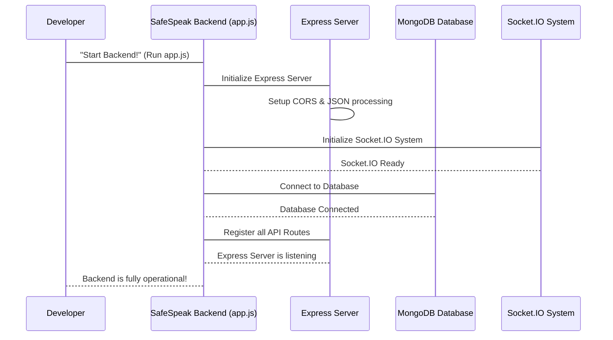

# Chapter 1: Server & API Foundation

Welcome to SafeSpeak! Imagine SafeSpeak is a large, busy building that helps people communicate safely. While your app on your phone is like the "front desk" where you interact, there's a whole lot happening "behind the scenes" to make everything work. This "behind the scenes" part is what we call the **backend**, and it needs a strong foundation to stand on.

This first chapter is all about understanding that foundation: the **Server & API Foundation**. Think of it as the building's blueprint, the electrical system, the main reception area, and the central control room all rolled into one! It's the core "engine" that powers the entire SafeSpeak backend application.

## What Problem Does This System Solve?

When you use the SafeSpeak app on your phone, you're constantly sending requests and receiving information. For example:

- You tap "Log In."
- You type a message and hit "Send."
- You want to see your emergency contacts.
- You tap "Send SOS!"

Each of these actions requires your app to "talk" to the SafeSpeak backend server, which might be running on a computer far away.

The **Server & API Foundation** solves the critical problem of being the **main point of contact** and **traffic director** for all these interactions. Without it:

- Your app wouldn't know where to send its requests.
- The server wouldn't understand what your app is asking for.
- Different parts of SafeSpeak (like user logins or emergency alerts) couldn't communicate with each other.
- The entire system wouldn't even be able to start up!

Essentially, this system ensures that when your SafeSpeak app sends a message or a request, it gets to the right place in the backend, is processed correctly, and a response is sent back to you. It's like the main receptionist that greets every visitor and guides them to the correct department.

Let's break down the key parts that form this vital foundation.

## Key Concepts of the Foundation

This foundational part of SafeSpeak is made up of several critical components working together:

### 1. The Main Engine: Express.js Server

- **What it is:** `Express.js` is like the powerful "engine" or "control panel" of our SafeSpeak backend. It's a very popular tool (called a "framework") for building web applications and APIs using Node.js (the technology SafeSpeak's backend is built with).
- **What it does:** It creates a web server that constantly "listens" for incoming requests from your SafeSpeak app. When your app sends a request, Express is the first to receive it, like a receptionist answering the main phone line.

### 2. The Navigation System: API Routes

- **What they are:** API (Application Programming Interface) routes are like specific "addresses" or "pathways" that your SafeSpeak app can send requests to. Think of them as different phone extensions or department names within our SafeSpeak building.
  - For example: `/api/auth/login` is the pathway for logging in.
  - `/api/sos/send-sos` is the pathway for sending an SOS alert.
- **What they do:** Each route is a defined "road" that leads to a specific "controller" (a piece of code that handles the request, like the `authController` for login or the `sosController` for SOS). This ensures that login requests go to the login handler, SOS requests go to the SOS handler, and so on, keeping everything organized.

### 3. The Security Checkpoint: CORS & Middleware

- **CORS (Cross-Origin Resource Sharing):** Imagine your SafeSpeak app is from one "country" (a specific web address like `app.safespeak.com`) and our backend server is in another "country" (`api.safespeak.com`). CORS is like a visa system that allows these two "countries" to communicate securely, even though they have different web addresses. Without it, web browsers might block your app from talking to the server due to security rules.
- **Middleware:** These are like "security guards" or "pre-processing steps" that requests go through _before_ they reach their final destination (the controller). For example, our `authMiddleware` (which you'll learn more about in [Chapter 4: User & Authentication System](04_user___authentication_system_.md)) is a middleware that checks if you have a valid digital token (your ID badge) before letting you access protected features.

### 4. The Memory Connection: Database Foundation

- **What it is:** This is the part that establishes the connection between our SafeSpeak backend and our database (MongoDB, which is managed using a tool called Mongoose).
- **What it does:** It's like plugging in the main power cable to our building's "memory bank." Without this connection, SafeSpeak can't save new users, retrieve emergency contacts, or store messages. It's essential for SafeSpeak to "remember" anything.

### 5. The Instant Update System: Socket.IO Foundation

- **What it is:** `Socket.IO` is a special library that allows for "real-time," two-way communication between your app and the server. Think of it like a dedicated phone line that stays open for instant messages, rather than having to make a new call for every little piece of information.
- **What it does:** It's set up here at the very beginning, creating the basic infrastructure for features like live chat or instant SOS alerts. We'll explore `Socket.IO` in much more detail in [Chapter 7: Real-time Interactions (Socket.IO)](07_real_time_interactions__socket_io__.md).

## How SafeSpeak Starts Up

Let's trace what happens when you start the SafeSpeak backend application, making it ready to serve your app!

When the SafeSpeak backend program is launched, it runs the `app.js` file. This file is the central "startup script" for the entire application.

**Simplified Code (from `safespeak-Backend/app.js`):**

```javascript
// safespeak-Backend/app.js
const express = require("express"); // Our main engine
const mongoose = require("mongoose"); // For database connection
const cors = require("cors"); // For cross-origin communication
const http = require("http"); // To create a basic web server
const { Server } = require("socket.io"); // For real-time features

require("dotenv").config(); // Load secret settings

const app = express(); // Create the Express app
const server = http.createServer(app); // Create an HTTP server

// Set up Socket.IO (for real-time)
const io = new Server(server, { cors: { origin: "*" } });

// Essential setup: allow communication and understand JSON
app.use(cors({ origin: "*" }));
app.use(express.json());

// Function to start everything
async function main() {
  await mongoose.connect(process.env.MONGO_URI); // Connect to database
  console.log("✅ MongoDB Connected");

  // Connect API pathways to their handlers (like departments)
  app.use("/api/auth", require("./routes/authRoutes")(io));
  app.use("/api/users", require("./routes/userRoutes"));
  // ... (other routes) ...

  const PORT = process.env.PORT || 5000;
  server.listen(PORT, () => console.log(`🚀 Server running on port ${PORT}`));
}

main(); // Run the startup function!
```

**Explanation:**

This `app.js` file is where everything begins when the SafeSpeak backend starts:

1.  **Imports:** It first brings in all the necessary tools like `express` (our engine), `mongoose` (for database), `cors` (for friendly communication), `http` (to create a basic web server), and `socket.io` (for instant updates).
2.  **Configuration:** It loads important settings (like the database address) from a secret `.env` file, keeping them secure.
3.  **Server Creation:** It creates the main web server (`app` using `express` and `server` using `http`).
4.  **Socket.IO Setup:** It sets up the `socket.io` system, which will allow for real-time communication later.
5.  **Middleware Setup:**
    - `cors()`: This is like setting up a friendly welcome sign that tells other apps it's okay to talk to this server, even if they are hosted on different addresses (e.g., your phone app vs. the backend server).
    - `express.json()`: This tells the server to automatically understand information sent in JSON format (which is how most apps send data over the internet).
6.  **Database Connection:** The `mongoose.connect()` line attempts to connect to our database. If this fails, the server stops, because SafeSpeak can't work without its memory bank!
7.  **Route Registration:** It then tells the `express` server about all the different API "pathways" (like `/api/auth` or `/api/users`) and which files (`authRoutes.js`, `userRoutes.js`, etc.) are responsible for handling requests to those pathways.
8.  **Server Listening:** Finally, `server.listen()` makes the server "turn on" and start listening for incoming requests on a specific "port" (like a phone number for the server).

**Example Output (What you see when the server starts):**

When you run the SafeSpeak backend program, you'll see messages in your console confirming that everything started correctly:

```
✅ MongoDB Connected
🚀 Server running on port 5000
```

These messages mean the database connection was successful and the web server is now running and ready to receive requests from your SafeSpeak app!

## What Happens Under the Hood?

Let's visualize the sequence of events when the SafeSpeak backend starts up:



**Non-code Walkthrough:**

1.  **Start Command:** You (as the developer) or a deployment system gives the command to start the SafeSpeak backend application. This launches the `app.js` file.
2.  **Express Initialization:** The `app.js` file first sets up the `Express` server. This is like opening the "reception desk" for all incoming internet requests. It also configures it to handle `CORS` (allowing communication from different app locations) and `JSON` data (the common language for web data).
3.  **Socket.IO Initialization:** Next, `app.js` prepares the `Socket.IO` system. This is like installing a special "instant message hotline" so your app can receive live updates later.
4.  **Database Connection:** Then, `app.js` attempts to connect to the `MongoDB Database`. This is a critical step; if it fails, the application can't function properly.
5.  **Route Registration:** Once the database is connected, `app.js` tells the `Express Server` about all the specific "API routes" (like `/api/auth/login`, `/api/sos/send-sos`). It registers which part of the code (`authRoutes`, `sosRoutes`, etc.) should handle requests arriving at each specific address.
6.  **Server Listening:** Finally, the `Express Server` starts "listening" on a specific network port. This means it's now officially "open for business" and ready to receive and process any requests from your SafeSpeak app!

### Deeper Dive into Code Files

Let's look at the specific files that form this foundation. Remember, these are simplified snippets to highlight the main idea.

- **`safespeak-Backend/app.js`**: This is the central file, the starting point for everything.

  ```javascript
  // safespeak-Backend/app.js (simplified)
  const express = require("express");
  const mongoose = require("mongoose");
  const cors = require("cors");
  const http = require("http");
  const { Server } = require("socket.io");
  require("dotenv").config(); // Load secret settings

  const app = express(); // The main Express application
  const server = http.createServer(app); // The underlying HTTP server

  // Setup CORS and JSON processing for incoming requests
  app.use(cors({ origin: "*" }));
  app.use(express.json());

  // Setup Socket.IO for real-time features
  const io = new Server(server, { cors: { origin: "*" } });
  io.on("connection", (socket) => {
    console.log("🔌 New client connected:", socket.id);
    // More Socket.IO event handlers will go here later
  });

  async function main() {
    await mongoose.connect(process.env.MONGO_URI); // Connect to database
    console.log("✅ MongoDB Connected");

    // Register API routes: connect URLs to their handler files
    app.use("/api/auth", require("./routes/authRoutes")(io)); // auth routes might use io
    app.use("/api/users", require("./routes/userRoutes"));
    // ... other app.use for more routes ...

    const PORT = process.env.PORT || 5000;
    server.listen(PORT, () => console.log(`🚀 Server running on port ${PORT}`));
  }
  main();
  ```

  **Explanation:** This code snippet shows how `app.js` orchestrates the entire startup process: initializing `Express` (our engine), setting up `CORS` (our visa system) and `JSON` parsing (our language translator), connecting to `MongoDB` (our memory bank), setting up `Socket.IO` (our instant hotline), and finally registering all the application's `API routes` so requests can be directed properly.

- **`safespeak-Backend/middlewares/authMiddleware.js`**: This is an example of a "middleware" that our foundation uses to protect routes.

  ```javascript
  // safespeak-Backend/middlewares/authMiddleware.js (simplified)
  const jwt = require("jsonwebtoken"); // Used to check digital tokens

  module.exports = (req, res, next) => {
    const authHeader = req.headers.authorization;
    if (!authHeader || !authHeader.startsWith("Bearer ")) {
      return res.status(401).json({ error: "Unauthorized: No token" });
    }
    const token = authHeader.split(" ")[1]; // Get the token
    try {
      const decoded = jwt.verify(token, process.env.JWT_SECRET);
      req.user = decoded; // Attach user info to the request
      next(); // Allow the request to continue to its destination
    } catch (err) {
      return res.status(403).json({ error: "Forbidden: Invalid token" });
    }
  };
  ```

  **Explanation:** This `authMiddleware` acts as a "security guard" that sits between an incoming request and its final destination. When a request comes in for a protected route (like adding an emergency contact or sending an SOS), this middleware checks the user's digital token (ID badge). If the token is valid, `next()` allows the request to continue. If not, it sends an error, preventing unauthorized access.

- **`safespeak-Backend/routes/*.js` (e.g., `routes/sosRoutes.js`):** These files define our API "pathways" and connect them to the actual logic.

  ```javascript
  // safespeak-Backend/routes/sosRoutes.js (simplified)
  const express = require("express");
  const router = express.Router(); // Create a router for SOS pathways
  const authMiddleware = require("../middlewares/authMiddleware"); // Our security guard
  const { sendSOS } = require("../controllers/sosController"); // The logic for sending SOS

  // Define the pathway: when a POST request comes to /api/sos/send-sos
  // first run authMiddleware, then run sendSOS logic
  router.post("/send-sos", authMiddleware, sendSOS);

  module.exports = router; // Make these pathways available
  ```

  **Explanation:** This route file sets up a specific `router` object. The `router.post("/send-sos", ...)` line defines a specific URL path (`/send-sos`). It also tells Express that before anyone can `POST` to this path, they must first pass through `authMiddleware` (our security guard). If they pass, then the `sendSOS` function (which contains the actual logic for sending an SOS) will be called. This ensures that only authenticated users can send an SOS.

## Conclusion

You've now uncovered the very heart of SafeSpeak: the **Server & API Foundation**. This crucial system, powered by `Express.js` (our engine), `CORS` (our visa), `Mongoose` (our memory connector), and `Socket.IO` (our instant hotline), acts as the main engine and navigation system for the entire application. It ensures that the backend is always ready to receive requests, direct them to the right place, maintain security, connect to the database, and even prepare for instant real-time communication. All the exciting features of SafeSpeak rely on this robust foundation to function.

Now that we understand how the server starts and manages general communication, let's dive deeper into one of its most exciting capabilities: the instant updates and live interactions made possible by `Socket.IO`. In the next chapter, we'll explore [Chapter 7: Real-time Interactions (Socket.IO)](07_real_time_interactions__socket_io__.md).

---
