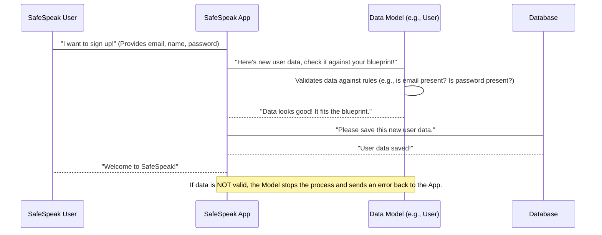

# Chapter 2: Data Models

In [Chapter 1: Server & API Foundation](01_server___api_foundation_.md), we learned how SafeSpeak's backend starts up, creates its "engine" using Express.js, and establishes a connection to its "memory bank" – the MongoDB database. We saw that the server is ready to receive requests and knows how to "talk" to the database.

But what exactly does SafeSpeak store in this memory bank? How does it remember who you are, your emergency contacts, or the messages you send? Imagine that memory bank is a giant, empty warehouse. You can't just throw things in randomly; you need a system, shelves, labels, and specific spots for different types of items. Otherwise, finding anything later would be a nightmare!

This is where **Data Models** come in!

## What are Data Models?

Think of Data Models as the "blueprints" for all the information SafeSpeak uses. They define exactly how different types of data should look when stored in our database. It's like having a specific form or template for every piece of information.

Let's break it down:

1.  **A "Model" is a Blueprint:**

    - Each model represents a specific "thing" or "concept" in SafeSpeak. For example, there's a blueprint for a "User" (someone who uses SafeSpeak), a blueprint for an "Emergency Contact", or a blueprint for a "Message" someone sends.
    - Just like a house blueprint ensures every house built from it has a kitchen, a "User" model ensures every user record has an email.

2.  **"Fields" are the Details:**

    - Within each blueprint, you define "fields." These are the specific pieces of information you want to store.
    - For a "User" model, fields might include `email`, `displayName`, or `password`.
    - For an "Emergency Contact," fields might be `name`, `phone`, or `relationship`.

3.  **"Rules" Keep Things Correct:**
    - Each field can have rules. These rules ensure the data is correct and complete.
    - Examples of rules:
      - `type: String`: This field must hold text.
      - `required: true`: This field absolutely _must_ have a value; it cannot be empty.
      - `unique: true`: The value in this field must be unique across all entries (like how no two users can have the exact same email).
      - `default: Date.now`: If no value is given, automatically fill it with the current date and time.

In SafeSpeak, we use a tool called `Mongoose` (which works with `MongoDB` databases) to create these blueprints. `Mongoose` helps us define these models easily.

## How SafeSpeak Uses Data Models

Let's take our example: storing information about a new user.

When a new user signs up for SafeSpeak, the application needs to save their details. It doesn't just throw the data into the database randomly. Instead, it uses the `User` Data Model as its guide, ensuring everything is in its proper place.

Here's a simplified look at the `User` model blueprint:

```javascript
// safespeak-Backend/models/User.js
const mongoose = require("mongoose");

const userSchema = new mongoose.Schema({
  email: { type: String, required: true, unique: true },
  displayName: { type: String },
  password: { type: String, required: true },
  // ... other fields like phone, imageUrl, createdAt, etc.
});

module.exports = mongoose.model("User", userSchema);
```

**Explanation:**

- `mongoose.Schema`: This is like picking up the blueprint paper.
- `email: { type: String, required: true, unique: true }`: This says: "Every user _must_ have an `email` (required), it must be text (String), and no two users can have the same email (unique)."
- `password: { type: String, required: true }`: "Every user _must_ have a `password` (required), and it must be text." (Note: In a real app, passwords are _always_ stored in a scrambled, secure way, not plain text!)

When SafeSpeak needs to save a new user, it creates an "instance" of this blueprint, fills in the details, and then saves it.

```javascript
// Imagine this code runs when a new user signs up
const User = require("../models/User"); // This gets our User blueprint

async function createNewUser(email, displayName, password) {
  try {
    const newUser = new User({
      email: email,
      displayName: displayName,
      password: password, // In real apps, this would be hashed!
    });

    await newUser.save(); // Save this new user based on the blueprint rules
    console.log("New user saved successfully!");
  } catch (error) {
    console.error("Error saving user:", error.message);
  }
}

// Example 1: Trying to create a user correctly
createNewUser("alice@example.com", "Alice Smith", "mySecretPass123");
// Output: New user saved successfully!

// Example 2: Trying to create a user without a required email
// createNewUser("", "Bob", "anotherPass");
// Output will show an error like "User validation failed: email: Path `email` is required."
```

In Example 2 above, if you try to create a user without an email or password, `Mongoose` (using our `User` model blueprint) will stop you because those fields are marked `required: true`. This prevents incomplete or "bad" data from entering our database, keeping everything neat and reliable.

## What Happens Under the Hood?

When SafeSpeak interacts with data using these models, here's a simplified step-by-step process:



**Non-code Walkthrough:**

1.  **User Action:** A SafeSpeak user performs an action, like signing up. They provide their information (email, display name, password).
2.  **App Receives:** The SafeSpeak application's backend receives this information from the user's phone app.
3.  **Model Lookup & Validation:** The backend knows it's dealing with a "User." It then uses the `User` Data Model (blueprint) to check if the information provided is valid. It verifies if all `required` fields are present and if the data types match the rules defined in the model.
4.  **Data Preparation:** If everything matches the blueprint (all rules are followed), the `Mongoose` model prepares the data in the correct format for storage.
5.  **Database Interaction:** The SafeSpeak app sends the perfectly organized data to the database to be saved.
6.  **Confirmation:** The database confirms that the data has been stored successfully. The SafeSpeak app then confirms to the user that their action was successful (e.g., "Welcome to SafeSpeak!"). If the data was _not_ valid (e.g., missing a required field), the Data Model would have caught the error, and the app would inform the user that something went wrong.

### Deeper Dive into Model Files

All SafeSpeak's data model blueprints live in the `safespeak-Backend/models/` folder. Each file usually defines one blueprint.

Let's look at `EmergencyContact.js` as another example:

```javascript
// safespeak-Backend/models/EmergencyContact.js
const mongoose = require("mongoose");

const emergencyContactSchema = new mongoose.Schema({
  userId: {
    type: mongoose.Schema.Types.ObjectId,
    ref: "User",
    required: true,
  },
  name: { type: String, required: true },
  relationship: { type: String },
  phone: { type: String },
  // ... other fields like email, fcmToken, createdAt, etc.
});

module.exports = mongoose.model("EmergencyContact", emergencyContactSchema);
```

**Key Points:**

- `userId: { type: mongoose.Schema.Types.ObjectId, ref: "User", required: true }`: This is super important! It tells us that every `EmergencyContact` **must** be linked to a specific `User`. The `type: mongoose.Schema.Types.ObjectId` means it's a special ID that refers to another entry in the database. The `ref: "User"` tells us _which_ other model it refers to – in this case, our `User` model blueprint. This is how different blueprints can be connected, just like a house blueprint might refer to a separate plumbing blueprint!
- `name: { type: String, required: true }`: Ensures every emergency contact has a name.

## Different Blueprints for Different Data

SafeSpeak uses many data models, each for a different kind of information. Here are a few examples:

| Model Name         | What it's a Blueprint for                         | Example Fields                         |
| :----------------- | :------------------------------------------------ | :------------------------------------- |
| `User`             | Information about a SafeSpeak user                | `email`, `displayName`, `password`     |
| `EmergencyContact` | Information about a user's emergency contact      | `userId`, `name`, `phone`, `email`     |
| `Message`          | Any message sent within SafeSpeak                 | `userId`, `text`, `toxicityScore`      |
| `Report`           | Details of a content safety report made by a user | `userId`, `reportType`, `message`      |
| `SOS`              | A distress signal sent by a user                  | `userId`, `location`, `sentAt`         |
| `Education`        | Educational content provided in the app           | `title`, `content`, `videoUrl`, `tags` |

Each of these models has its own specific fields and rules to keep SafeSpeak's data organized, consistent, and reliable.

## Conclusion

You've just learned about Data Models, the essential "blueprints" that define how information is structured and stored in SafeSpeak. By using these models, we ensure that all data is consistent, correct, and easy to manage, just like an architect's plan keeps a building project on track. This foundational understanding of how data is structured is key to seeing how all the pieces of SafeSpeak fit together.

Now that we know how data is structured for our "memory bank," let's explore how SafeSpeak communicates with the outside world, beyond just saving data. In the next chapter, we'll dive into [Chapter 3: External Communication & Utilities](03_external_communication___utilities_.md).

---
