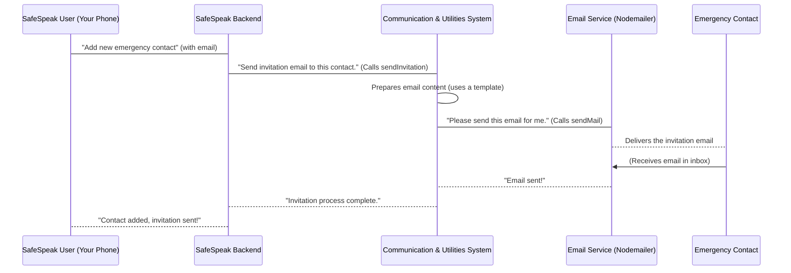

# Chapter 3: External Communication & Utilities

In [Chapter 2: Data Models](02_data_models_.md), we learned how SafeSpeak structures and stores all its important information, like details about users and emergency contacts. We know the backend has its "memory bank" organized. But what happens when SafeSpeak needs to "talk" to the outside world? What if it needs to send an email or a quick alert to your phone?

Imagine SafeSpeak is like a bustling office building. We've mastered how to organize all our files and records (Data Models). Now, we need a way to send out important mail, make urgent phone calls, or send instant messages to people who aren't physically in our office. This is where the **External Communication & Utilities** system comes in! It's like the office's "communication department" and "handy toolkit" all rolled into one.

## What Problem Does This System Solve?

Think about how SafeSpeak helps you stay safe. If you add a new emergency contact, that person needs to know they've been added and how to get the app. If you activate an SOS alert, your phone needs to get an urgent notification right away. These actions require SafeSpeak to reach out and deliver messages beyond its own direct user interface.

This system handles all those important outgoing messages and provides helpful tools for common tasks. It ensures:

- **You stay informed:** Get urgent alerts or important updates directly on your device.
- **Your safety network is connected:** Your emergency contacts receive invitations to join and help keep you safe.
- **The app runs smoothly:** By having standard ways to format messages sent back to your phone, making everything consistent and easy to understand.

Let's use a clear example: **Sending an invitation email to a new emergency contact.** This is a perfect example of "external communication" that relies on these utilities.

## Key Concepts of the System

This part of SafeSpeak is designed with two main purposes:

### 1. External Communication: Talking to the Outside World

This is all about sending messages _from_ SafeSpeak _to_ people or other services outside the app itself.

- **Emails (Nodemailer):** Imagine SafeSpeak needs to send an invitation, a password reset link, or a welcome message. It uses a special "mail delivery service" (powered by `Nodemailer`) to reliably send these emails. Think of `Nodemailer` as the post office worker who makes sure your mail gets delivered.
- **Push Notifications (Firebase Cloud Messaging - FCM):** These are those small pop-up messages that appear on your phone, even when you're not actively using the app (like a weather alert or a breaking news update). SafeSpeak uses **Firebase Cloud Messaging (FCM)** as a "megaphone" to send urgent alerts, such as an SOS signal, directly to your phone.

### 2. Utilities: The App's Handy Toolkit

These are small, reusable tools and functions that help different parts of SafeSpeak work efficiently and consistently.

- **`responseWrapper`:** Imagine every department in our office building uses a standard template for writing memos. `responseWrapper` does something similar for our app. It's a "standard form" that ensures every message SafeSpeak sends back to your phone (after you log in, add a contact, etc.) has the same clear structure (e.g., `success`, `message`, `data`). This makes it easy for your phone app to understand the response every time.
- **Other Helpers:** There might be other small, specialized tools here, like functions that format text, handle dates, or perform simple calculations, making the overall code cleaner and easier to manage.

## How SafeSpeak Sends Invitations

Let's walk through our example: **sending an invitation email to a new emergency contact.**

When you add a new emergency contact in SafeSpeak (we'll dive into _how_ you add them in [Chapter 5: Emergency Services & Contacts](05_emergency_services___contacts_.md)), the app needs to send them an email inviting them to join SafeSpeak.

**Example Input (when adding a contact):**

- Name: `Jane Doe`
- Email: `jane.doe@example.com`
- A special link for Jane to set her password.

**Simplified Code (What SafeSpeak does to send the invite):**

```javascript
// Imagine this code runs when you add a new emergency contact
const sendInvitation = require("../utils/sendInvitation"); // Our invitation tool

async function sendContactInvitation(
  contactName,
  contactEmail,
  passwordResetLink
) {
  try {
    // Call our specialized tool to send the invitation
    await sendInvitation({
      name: contactName,
      email: contactEmail,
      resetLink: passwordResetLink,
    });
    console.log("Invitation sent successfully!");
  } catch (error) {
    console.error("Error sending invitation:", error.message);
  }
}

// Example: Inviting Jane Doe
sendContactInvitation(
  "Jane Doe",
  "jane.doe@example.com",
  "https://safespeak.app/reset-pass/xyz789" // A dummy reset link
);
// Output: Invitation sent successfully! (And Jane Doe receives an email)
```

**Explanation:**

This simple piece of code shows how easy it is for other parts of SafeSpeak to use our "communication department." You just tell it the contact's name, email, and the special link, and our `sendInvitation` tool handles all the complex steps of preparing and sending the email.

## What Happens Under the Hood?

Let's see how our "communication department" handles sending an invitation email step-by-step:



**Non-code Walkthrough:**

1.  **User Action:** You use your SafeSpeak app on your phone to add a new emergency contact, providing their name and email.
2.  **Backend Receives:** The SafeSpeak backend server receives this request from your app.
3.  **Calls Communication System:** The backend knows it needs to send an invitation email, so it asks the "Communication & Utilities System" to handle this.
4.  **Prepare Email:** Inside the "Communication & Utilities System," a specific function (like `sendInvitation`) is used. This function takes the contact's details and builds the full email message, including a friendly greeting, the SafeSpeak app download link, and the special password setup link.
5.  **Use Mail Delivery Service:** The `sendInvitation` function then hands over the prepared email to a specialized "mail delivery service" (the `sendMail` utility, which uses `Nodemailer`).
6.  **Email Sent:** The `sendMail` service connects to an external email server (like Gmail's mail server) and sends the email to the contact's email address.
7.  **Contact Receives:** The emergency contact receives the invitation in their email inbox!
8.  **Confirmation:** The mail delivery service confirms to SafeSpeak that the email was sent, and SafeSpeak then confirms to you (on your phone app) that the contact was added and the invitation was successfully sent.

### Deeper Dive into Code Files

All SafeSpeak's utility functions, including those for external communication, live in the `safespeak-Backend/utils/` and `safespeak-Backend/helper/` folders.

Let's look at the actual code files that make up this "communication department" and "toolkit":

- **`safespeak-Backend/utils/sendMail.js`**: This is our core "mail delivery service." It's responsible for the actual sending of emails using `Nodemailer`.

  ```javascript
  // safespeak-Backend/utils/sendMail.js
  const nodemailer = require("nodemailer");

  const sendMail = async (to, subject, html) => {
    // 1. Set up how we connect to the email server (like knowing the post office address)
    const transporter = nodemailer.createTransport({
      host: "smtp.gmail.com", // Example: Gmail's server
      port: 587, // Standard port for sending email
      secure: false, // Not using SSL/TLS directly, but STARTTLS
      auth: {
        user: process.env.EMAIL_USER, // Our SafeSpeak email address (e.g., safespeak@gmail.com)
        pass: process.env.EMAIL_PASS, // Our SafeSpeak email password (kept secret in .env!)
      },
    });

    // 2. Send the actual email using the transporter
    await transporter.sendMail({
      from: `"SafeSpeak 🔐" <${process.env.EMAIL_USER}>`, // Who the email appears to be from
      to, // Who the email is going to (from the function's input)
      subject, // The email's subject line
      html, // The full email content (can include fancy HTML formatting)
    });
  };

  module.exports = sendMail;
  ```

  **Explanation:** This file sets up a `transporter` (think of it as our email-sending machine) using `nodemailer`. It uses our email account details (loaded securely from `process.env`) to log into an email server. Then, the `sendMail` function uses this `transporter` to send the email to the specified recipient with the given subject and HTML content.

- **`safespeak-Backend/utils/sendInvitation.js`**: This file _uses_ the `sendMail` utility to create a specific kind of email: an invitation.

  ```javascript
  // safespeak-Backend/utils/sendInvitation.js
  const sendMail = require("./sendMail"); // Import our mail delivery service

  const sendInvitation = async ({ name, email, resetLink }) => {
    const appLink = "https://we.tl/t-C48T8iPC1G"; // Link to download SafeSpeak app

    // 1. Build the email's content using HTML for good formatting
    const htmlContent = `
      <h2>📲 You're Invited to Join SafeSpeak!</h2>
      <p>Hi ${name || "there"},</p>
      <p>You've been added as an emergency contact on <strong>SafeSpeak</strong>.</p>
      <p>
        <a href="${appLink}" style="color: #007bff; text-decoration: none;">🔽 Download SafeSpeak App</a>
      </p>
      <p>Please <a href="${resetLink}" style="color: #007bff;">click here to set your password</a>.</p>
      <p>Thanks,<br/>The SafeSpeak Team 🔐</p>
    `;

    // 2. Call our general mail delivery service to send this specific invitation
    await sendMail(email, "📩 You're Invited to Join SafeSpeak!", htmlContent);
  };

  module.exports = sendInvitation;
  ```

  **Explanation:** This `sendInvitation` function is a specialized wrapper. It takes easy-to-understand details like `name`, `email`, and `resetLink`. It then crafts a professional-looking email message (using HTML for formatting) and passes it, along with the recipient's email and subject, to our more general `sendMail` utility, which then performs the actual sending.

- **`safespeak-Backend/utils/sendNotification.js`**: This file handles sending those quick "push notifications" to phones using Firebase Cloud Messaging (FCM).

  ```javascript
  // safespeak-Backend/utils/sendNotification.js
  const axios = require("axios"); // Tool for making web requests

  exports.sendPushNotification = async ({ to, title, body, data }) => {
    try {
      const serverKey = process.env.FCM_SERVER_KEY; // Secret key for Firebase authentication
      await axios.post(
        "https://fcm.googleapis.com/fcm/send", // Firebase's special address for sending messages
        {
          to, // The unique token for the target phone device
          notification: { title, body }, // The visible part of the notification (what it says)
          data, // Extra hidden information the app can use when the notification is tapped
        },
        {
          headers: {
            "Content-Type": "application/json",
            Authorization: `key=${serverKey}`, // Our permission (authentication) to send via Firebase
          },
        }
      );
    } catch (err) {
      console.error("❌ Failed to send push notification:", err.message);
    }
  };
  ```

  **Explanation:** This function uses `axios` (a tool for sending requests over the internet) to "talk" to Google's Firebase Cloud Messaging (FCM) service. It sends a message to FCM, telling it what notification to deliver (`title`, `body`) and to which specific device (`to`), using a special `serverKey` as permission. FCM then takes care of delivering the message to the user's phone, even if the app isn't open.

- **`safespeak-Backend/helper/responseWrapper.js`**: This is a key "utility" function that helps standardize how SafeSpeak sends messages back to your app.

  ```javascript
  // safespeak-Backend/helper/responseWrapper.js
  function responseWrapper(success, message, status, data, error) {
    return {
      success, // Was the action successful? (true/false)
      message, // A short, human-readable message (e.g., "Login successful", "User not found")
      status: status ?? 500, // HTTP status code (e.g., 200 for OK, 400 for bad request, 500 for server error)
      data: data ?? null, // Any useful information to send back (e.g., user profile, list of contacts)
      error: error ?? null, // Details if something went wrong (only present if success is false)
    };
  }

  module.exports = { responseWrapper };
  ```

  **Explanation:** This function is like a template for all responses sent from the backend to the mobile app. Instead of different parts of SafeSpeak sending back responses in various ways, they all use `responseWrapper`. This ensures that your SafeSpeak app always receives information in the same, easy-to-understand format, making the app itself much easier to build and manage. It promotes consistency and makes debugging much simpler!

## Conclusion

You've just learned about SafeSpeak's "communication department" and "toolkit" – the **External Communication & Utilities** system. This vital part of the application handles sending important messages like email invitations and urgent push notifications, ensuring SafeSpeak can reach out to you and your contacts efficiently. It also provides useful helper functions, like `responseWrapper`, that keep the app's internal communication consistent and tidy.

Now that we understand how SafeSpeak communicates outside its walls, let's dive into one of its most important core features: how it handles users and secures access to the application. In the next chapter, we'll explore [Chapter 4: User & Authentication System](04_user___authentication_system_.md).

---
