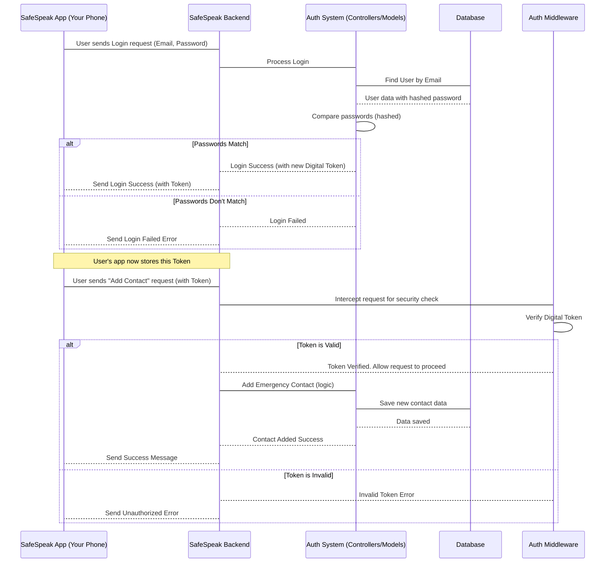

# Chapter 4: User & Authentication System

In [Chapter 2: Data Models](02_data_models_.md), we learned about the "blueprints" for all the information SafeSpeak uses, including how we structure and store user details using the `User` model. Then, in [Chapter 3: External Communication & Utilities](03_external_communication___utilities_.md), we explored how SafeSpeak sends messages out to the world, like invitation emails.

But before anyone can send an email, create an emergency contact, or use any SafeSpeak feature, we need to know _who they are_! Imagine our SafeSpeak building (from Chapter 1) is now fully set up with its blueprint (data models) and its communication lines (utilities). The next crucial step is to add a "membership desk" and a "security checkpoint." This is exactly what the **User & Authentication System** does. It manages how users sign up, log in, and proves their identity so they can access the app's features safely.

## What Problem Does This System Solve?

Every secure application needs to answer fundamental questions about its users:

- **Who are you?** When you open SafeSpeak, how does it know it's _you_ and not someone else trying to use your account?
- **Are you really you?** How do we stop unauthorized people from pretending to be you?
- **What are you allowed to do?** Once you're identified, how does the app know which features you can use (e.g., send an SOS, view your contacts)?

The **User & Authentication System** solves these problems by providing secure ways for users to register (sign up) and log in. It verifies identities, keeps passwords secret, and makes sure that once you're logged in, you can safely use the protected parts of SafeSpeak.

Let's use the central use case of **signing up and logging in** to SafeSpeak to understand this system.

## Key Concepts of the System

This system is built around a few important ideas:

### 1. The "User"

At the core of it all is **you**, the user! When you sign up for SafeSpeak, the system creates a "User" record in our database using the `User` Data Model we discussed in Chapter 2. This record holds your basic identity information like your email and a securely scrambled version of your password.

### 2. Authentication: Proving Who You Are

Authentication is the process where SafeSpeak verifies your identity. It's like showing your ID at a security checkpoint.

- **Signing Up (Registration):** This is when you create your new SafeSpeak account. You provide a unique email, your name, and choose a strong password. The system takes this information and securely stores it as your new "User" record.
- **Logging In:** When you want to use SafeSpeak again, you tell the app your email and password. The system checks if they match your stored record. If they do, you are "authenticated" – meaning, your identity has been successfully verified!

### 3. Secure Passwords (Hashing)

You might wonder how SafeSpeak keeps your password safe. We **never** store your actual password directly in our database. Instead, when you sign up or change your password, we use a special one-way scrambling process called **hashing**.

Imagine you tell SafeSpeak your password is "superSecret123". SafeSpeak immediately turns this into a random-looking string of characters, like "ks2f9p3h0q1z7x8w4v6u5t". This scrambled version is what gets stored. When you log in and type "superSecret123" again, SafeSpeak scrambles it _again_ and compares the _new_ scrambled version to the _stored_ scrambled version. If they match, it knows you entered the correct password without ever knowing what your original password was! This makes it incredibly secure.

### 4. Digital Tokens: Your Temporary ID Badge

Once you're successfully logged in, SafeSpeak doesn't ask for your email and password every single time you want to send a message or check contacts. That would be very annoying! Instead, it gives you a special "digital token."

Think of this token like a temporary ID badge or a VIP pass. After you've passed the initial security check (logged in), you just show this badge for quick entry to other protected areas of the app. The system quickly checks your token to confirm you're still the authenticated user, without needing your password again. These tokens are temporary and expire after a while, like a guest pass that needs to be renewed (by logging in again).

### 5. Firebase (Our Alternative Login Helper)

SafeSpeak also uses **Firebase**, a service by Google, for some aspects of user management, particularly for alternative login methods (like "Continue with Google" if implemented) and for sending certain types of push notifications (though the core notification sending is handled by utilities in Chapter 3). While our main email/password system is built directly into our backend, Firebase offers a robust alternative or helper for certain user-related features.

## How SafeSpeak Manages You: Sign Up & Log In

Let's walk through the primary use cases of this system.

### Use Case 1: Signing Up (Registering a New Account)

When you sign up for SafeSpeak, you provide your name, email, phone number, and choose a password.

**Example Input (from your SafeSpeak app):**

````
Name: Jane Doe
Email: jane.doe@example.com
Password: MyNewPassword!
Phone: +1234567890
**Simplified Code (from `safespeak-Backend/controllers/authController.js`):**

```javascript
// ... inside registerController function
const { name, email, password, phone, fcmToken } = req.body; // Data from your app

// 1. Check if email already exists
const existingUser = await User.findOne({ email });
// ... if exists, send error response ...

// 2. Scramble the password securely using hashing
const hashedPassword = await bcrypt.hash(password, 10);

// 3. Create a new User record based on our blueprint
const newUser = new User({
  displayName: name,
  email,
  password: hashedPassword, // Store the scrambled password
  phone,
  fcmToken, // Token for push notifications (from Chapter 3)
});

// 4. Save the new user to the database
await newUser.save();

// 5. Generate a digital token (ID badge) for the new user
const token = jwt.sign({ id: newUser._id }, process.env.JWT_SECRET, {
  expiresIn: "7d",
});

// ... send success response with the token and user info ...
````

**Explanation:**

1.  SafeSpeak first checks its database to make sure no one else has already registered with that email address.
2.  Your chosen password (`MyNewPassword!`) is immediately converted into a scrambled code (`hashedPassword`) using `bcrypt.hash`. This scrambled code is the only thing stored in the database, not your actual password.
3.  A new `User` record is created, filling in the `displayName`, `email`, `phone`, and the `hashedPassword` according to the `User` Data Model (from [Chapter 2: Data Models](02_data_models_.md)).
4.  This new user record is then saved permanently in SafeSpeak's database.
5.  Finally, SafeSpeak creates a `token` (your digital ID badge) using `jwt.sign`. This token allows your app to stay logged in without asking for your password every time. The token is set to expire after 7 days, so you'll eventually need to log in again.

**Example Output (what your SafeSpeak app receives after successful signup):**

```json
{
  "success": true,
  "message": "User registered successfully",
  "data": {
    "token": "eyJhbGciOiJIUzI1Ni...", // This is your unique digital token
    "user": {
      "id": "654321abcdef...", // Your unique ID in the database
      "name": "Jane Doe",
      "email": "jane.doe@example.com",
      "phone": "+1234567890"
    }
  }
}
```

Your app then saves this `token` securely to use for future requests.

### Use Case 2: Logging In (Accessing Your Account)

Once you have an account, you can log in using your email and password.

**Example Input (from your SafeSpeak app):**

```
Email: jane.doe@example.com
Password: MyNewPassword!
```

**Simplified Code (from `safespeak-Backend/controllers/authController.js`):**

```javascript
// ... inside logIn function
const { email, password, fcmToken } = req.body; // Data from your app

// 1. Find the user in the database by their email
const user = await User.findOne({ email });
// ... if user not found, send error response ...

// 2. Compare the provided password with the stored scrambled password
const isMatch = await bcrypt.compare(password, user.password);
// ... if passwords don't match, send error response ...

// 3. Update the FCM token if provided (for push notifications)
if (user.fcmToken === "" || user.fcmToken !== fcmToken) {
  user.fcmToken = fcmToken;
  await user.save();
}

// 4. If passwords match, generate a new digital token for this login session
const token = jwt.sign(
  { id: user._id, role: user.role },
  process.env.JWT_SECRET,
  { expiresIn: "7d" }
);

// ... emit Socket.IO event for real-time updates (from Chapter 7) ...
// ... send success response with the token and user info ...
```

**Explanation:**

1.  SafeSpeak searches its database for a user with the provided `email`.
2.  If found, it takes the `password` you just entered, scrambles it (hashes it) in the same way it did when you signed up, and then compares this _newly scrambled_ password with the _already stored scrambled_ password from the database. It's like checking if two secret codes match, without ever knowing the original secret.
3.  If the passwords match, you're successfully logged in! A new `token` (your temporary digital ID badge) is generated for this session and sent back to your app. If an FCM token is also provided (for push notifications, see [Chapter 3: External Communication & Utilities](03_external_communication___utilities_.md)), it updates this in your user record.
4.  SafeSpeak might also send a "login_success" message using Socket.IO (our real-time system, from [Chapter 7: Real-time Interactions (Socket.IO)](07_real_time_interactions__socket_io__.md)).

**Example Output (what your SafeSpeak app receives after successful login):**

```json
{
  "success": true,
  "message": "Login successful",
  "data": {
    "token": "eyJhbGciOiJIUzI1Ni...", // Your new digital token
    "user": {
      "id": "654321abcdef...",
      "name": "Jane Doe"
    }
  }
}
```

### Use Case 3: Protecting Actions (Using Your ID Badge)

After logging in, whenever your app wants to do something sensitive or personal, like add an [Emergency Contact](05_emergency_services___contacts_.md) or [send an SOS](05_emergency_services___contacts_.md), it sends your digital token along with the request.

**Simplified Code (from `safespeak-Backend/middlewares/authMiddleware.js`):**

```javascript
// ... inside the authentication middleware
const authHeader = req.headers.authorization;

// 1. Check if the digital token is even present in the request
if (!authHeader || !authHeader.startsWith("Bearer ")) {
  return res.status(401).json({ error: "Unauthorized: No token provided" });
}

const token = authHeader.split(" ")[1]; // Get the actual token string

try {
  // 2. Verify the token using a secret key
  const decoded = jwt.verify(token, process.env.JWT_SECRET);
  req.user = decoded; // Attach user info from token to the request
  next(); // Allow the request to continue to its destination
} catch (err) {
  // If verification fails (e.g., token is fake or expired)
  return res.status(403).json({ error: "Forbidden: Invalid token" });
}
```

**Explanation:**

1.  When your app makes a request for a protected action (e.g., to `/api/emergency-contacts/add`), it includes your digital `token` in a special part of the request called the "authorization header."
2.  A special "security guard" piece of code called `authMiddleware` intercepts this request _before_ it reaches the part of the code that handles adding contacts.
3.  This middleware checks if a `token` is present. If it is, it uses a secret key (known only to SafeSpeak's backend) to verify if the token is authentic and hasn't been tampered with or expired.
4.  If the token is valid, the `authMiddleware` says `next()`, allowing the request to proceed to its intended function (like adding the emergency contact). If the token is missing or invalid, the middleware immediately sends back an error, preventing unauthorized access.

## What Happens Under the Hood?

Let's visualize the simplified step-by-step process of logging in and then making a protected request:



**Non-code Walkthrough:**

1.  **Login Attempt:** You type your email and password into the SafeSpeak app on your phone and tap "Login." Your app sends this information to the SafeSpeak Backend.
2.  **Backend Routes Request:** The backend (using its API Routes from [Chapter 1: Server & API Foundation](01_server___api_foundation_.md)) directs this login request to the correct part of the "Auth System."
3.  **User Lookup & Password Check:** The Auth System looks up your email in the Database to find your user record, which contains your scrambled password. It then takes the password you just entered, scrambles it, and compares it to the stored scrambled version.
4.  **Token Issued (or Error):**
    - If the passwords match, the Auth System issues a brand-new digital `token` (your ID badge) and sends it back to your app. Your app then saves this token.
    - If the passwords don't match, the Auth System sends an error message back, and you cannot log in.
5.  **Protected Action:** Now that you're logged in, you try to "Add a new Emergency Contact." Your SafeSpeak app automatically includes your saved digital `token` with this request.
6.  **Security Check (Middleware):** When this "Add Contact" request arrives at the SafeSpeak Backend, it first passes through the `Auth Middleware` (our security checkpoint). This middleware quickly verifies that your digital `token` is legitimate and still valid.
7.  **Access Granted (or Denied):**
    - If your `token` is valid, the `Auth Middleware` allows the request to continue to the actual logic for adding an emergency contact.
    - If your `token` is invalid (e.g., expired, or someone tried to fake it), the `Auth Middleware` immediately stops the request and sends an "Unauthorized" error back to your app, preventing any sensitive action.

### Deeper Dive into Code Files

Let's look at the specific files that implement this system:

- **`safespeak-Backend/models/User.js`**: This is the blueprint for our user data.

  ```javascript
  // safespeak-Backend/models/User.js
  const mongoose = require("mongoose");

  const userSchema = new mongoose.Schema({
    email: { type: String, required: true, unique: true },
    displayName: { type: String },
    password: { type: String, required: true }, // Stores the HASHED password!
    phone: { type: String },
    imageUrl: { type: String, default: "" },
    fcmToken: { type: String }, // For push notifications via Firebase
    isAutoCreated: { type: Boolean, default: false },
    createdAt: { type: Date, default: Date.now },
  });

  module.exports = mongoose.model("User", userSchema);
  ```

  **Explanation:** This file defines the exact structure (`Schema`) for every user record in our database. Notice the `password` field is a `String`, but we know it will store the _scrambled_ version of the password, not the plain text. The `fcmToken` is also stored here, allowing us to send push notifications directly to a user's device (as seen in [Chapter 3: External Communication & Utilities](03_external_communication___utilities_.md)).

- **`safespeak-Backend/config/firebase.js`**: This file sets up our connection to Firebase services.

  ```javascript
  // safespeak-Backend/config/firebase.js (simplified for this chapter)
  const admin = require("firebase-admin");
  const serviceAccount = require("../firebaseServiceAccount.json"); // Your Firebase secret key

  // Initialize Firebase Admin SDK
  admin.initializeApp({
    credential: admin.credential.cert(serviceAccount),
    // storageBucket: "your-bucket-name.appspot.com", // Optional for storage
  });

  const auth = admin.auth(); // Provides Firebase Authentication features
  // const messaging = admin.messaging(); // Provides Firebase Cloud Messaging features
  module.exports = auth; // Export Firebase Auth for use in controllers
  // For messaging, it's typically imported directly where needed, or handled via a dedicated module.
  ```

  **Explanation:** This code initializes the Firebase Admin SDK. The `admin.auth()` part allows SafeSpeak to interact with Firebase's own user management features (like creating users via Firebase or verifying tokens from Google Sign-In).

- **`safespeak-Backend/controllers/authController.js`**: This file contains the "brain" or the actual functions that handle sign up, log in, and other authentication logic.

  ```javascript
  // safespeak-Backend/controllers/authController.js (simplified)
  const User = require("../models/User"); // Our User blueprint
  const bcrypt = require("bcryptjs"); // For scrambling passwords
  const jwt = require("jsonwebtoken"); // For creating digital tokens
  // const auth = require("../config/firebase"); // Firebase auth tool
  // const messaging = require("../config/firebase"); // Firebase messaging tool

  module.exports = (io) => ({
    // Handles user registration (signup)
    registerController: async (req, res) => {
      // ... (as shown in the "Signing Up" example above) ...
      // Uses User model, bcrypt.hash, newUser.save(), jwt.sign
      // Also potentially uses 'messaging.send' if FCM token is present
    },

    // Handles user login
    logIn: async (req, res) => {
      // ... (as shown in the "Logging In" example above) ...
      // Uses User.findOne, bcrypt.compare, jwt.sign, and updates fcmToken
      // Emits 'login_success' event via Socket.IO
    },

    // Handles Firebase-specific authentication (e.g., Google Sign-In)
    firebaseAuth: async (req, res) => {
      // Verifies Firebase ID token, creates/updates User in our DB
    },

    // Handles Firebase-specific signup
    firebaseSignup: async (req, res) => {
      // Creates user directly in Firebase Auth, then mirrors to our DB
    },
  });
  ```

  **Explanation:** This controller is where all the work of authentication happens. It imports and uses the `User` model, the `bcryptjs` library for password hashing, and `jsonwebtoken` for creating tokens. It also provides methods for integrating with Firebase authentication if your app supports social logins.

- **`safespeak-Backend/middlewares/authMiddleware.js`**: This file contains the "security guard" logic.

  ```javascript
  // safespeak-Backend/middlewares/authMiddleware.js
  const jwt = require("jsonwebtoken"); // For verifying digital tokens

  module.exports = (req, res, next) => {
    const authHeader = req.headers.authorization;
    if (!authHeader || !authHeader.startsWith("Bearer ")) {
      return res.status(401).json({ error: "Unauthorized: No token" });
    }

    const token = authHeader.split(" ")[1]; // Extract the token

    try {
      const decoded = jwt.verify(token, process.env.JWT_SECRET); // Verify token
      req.user = decoded; // Attach user info from token to the request
      next(); // Allow the request to proceed if token is valid
    } catch (err) {
      return res.status(403).json({ error: "Forbidden: Invalid token" });
    }
  };
  ```

  **Explanation:** This `authMiddleware` is a function that sits in the request pathway. Before any sensitive action is processed, this middleware runs, checks for a valid digital token (ID badge), and either allows the request to continue (`next()`) or blocks it with an error.

- **`safespeak-Backend/routes/authRoutes.js`**: This file defines the specific web addresses (API routes) for authentication.

  ```javascript
  // safespeak-Backend/routes/authRoutes.js
  const express = require("express");

  module.exports = (io) => {
    const router = express.Router();
    const authController = require("../controllers/authController")(io);

    // Define the pathways for authentication
    router.post("/firebaseAuth", authController.firebaseAuth);
    router.post("/signup", authController.firebaseSignup);
    router.post("/login", authController.logIn);
    router.post("/register", authController.registerController);

    return router;
  };
  ```

  **Explanation:** This file sets up specific URLs (like `/login` or `/register`) that your SafeSpeak app can send requests to. It links these URLs to the corresponding functions within the `authController.js` file, ensuring that when you try to log in, the correct code handles your request.

## Conclusion

You've just learned about the **User & Authentication System**, which is SafeSpeak's "membership desk" and "security checkpoint." This vital system ensures that users can securely sign up and log in, protecting their accounts and limiting access to features only for authenticated users. By using password hashing, digital tokens (ID badges), and sometimes external services like Firebase, SafeSpeak keeps user data private and the application secure.

Now that we understand who is using SafeSpeak and how they get access, let's dive into some of the core features that keep users safe and connected. In the next chapter, we'll explore [Chapter 5: Emergency Services & Contacts](05_emergency_services___contacts_.md).

---
