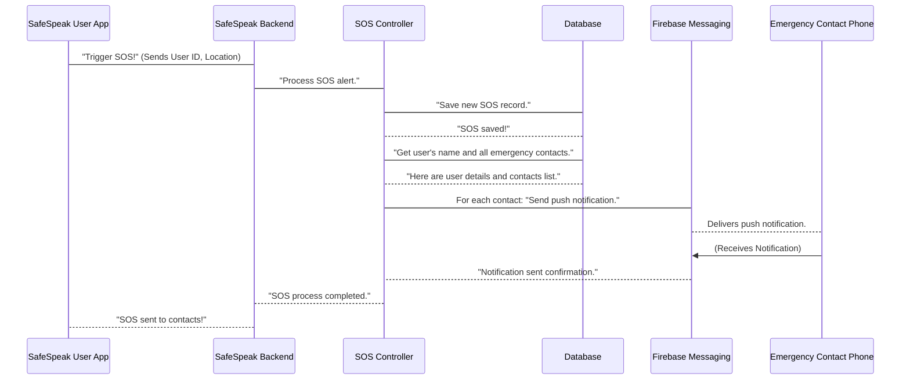

# Chapter 5: Emergency Services & Contacts

In [Chapter 4: User & Authentication System](04_user___authentication_system_.md), we learned how SafeSpeak knows _who you are_ and how it keeps your account secure through sign-up and log-in. Now that we understand how users get access and how their data is protected, let's dive into one of SafeSpeak's most critical features: getting immediate help when you need it most.

Imagine you're in a situation where you feel unsafe or are facing an emergency. Fumbling through your phone to find contact numbers, open messages, and type out your location can take precious time that you don't have. SafeSpeak solves this by acting like a **personal safety network** at your fingertips. It's like having a specialized "panic button" connected directly to your most trusted people.

## What Problem Does This System Solve?

SafeSpeak is built to help you stay safe. In an emergency, two things are absolutely essential:

1.  **Quick Alert:** You need a lightning-fast way to signal for help.
2.  **Trusted Helpers:** You need to instantly reach a predefined group of people who will know you need help and, importantly, _where you are_.

This **Emergency Services & Contacts** system directly addresses these urgent needs. It allows you to:

- **Set Up Trusted Contacts:** Create and manage a personal list of family, friends, or guardians who you want to be notified in an emergency.
- **Send SOS Alerts:** With just a simple tap or action, dispatch an urgent distress signal that includes your current location to all your designated trusted contacts.
- **Ensure Rapid Response:** The system is designed to send these critical alerts instantly, aiming to get you the fastest possible help when every second counts.

Let's focus on the most vital use case to understand this system: **sending an SOS alert with your location to your emergency contacts.**

## Key Concepts of the System

This system brings together two essential parts:

### 1. Emergency Contacts: Your Safety Network

Think of this as your personal, super-important "safety address book." These are the people you've chosen to be your first point of contact in an urgent situation.

- **Who they are:** Each emergency contact is a record stored in SafeSpeak's database. Just like your `User` information, we have an `EmergencyContact` [Data Model](02_data_models_.md) that defines exactly how this information is structured and stored.
- **What information is stored:** We keep track of their name, phone number, email, and, very importantly, who _you_ are (a `userId` that links them directly to your account). It might also store a special token (`fcmToken`) for sending them instant app notifications.
- **How they are managed:** You can easily add new contacts, view your full list, update their details if something changes, or remove them, just like managing entries in a regular phone book.
- **Linking to Users:** When you add a new contact, SafeSpeak can even automatically create a basic `User` account for them if they don't already have one. This makes it easier for them to receive alerts and potentially use SafeSpeak themselves.

### 2. SOS Alerts: The Panic Button

This is the core feature for sending out a distress signal.

- **Triggering an SOS:** When you activate the SOS feature (for example, by tapping an SOS button in the app), SafeSpeak automatically captures your current location (like GPS coordinates) and the exact time of the alert.
- **Saving the Record:** This emergency event is immediately saved in SafeSpeak's database. We use an `SOS` [Data Model](02_data_models_.md) to log all the details of the alert. This creates a helpful record of the incident.
- **Notifying Contacts:** Right after saving the alert, SafeSpeak quickly reaches out to all the emergency contacts you've set up. It uses the [External Communication & Utilities](03_external_communication___utilities_.md) system, specifically **push notifications**, to send an urgent pop-up message directly to their phones.

## How SafeSpeak Helps You: Sending an SOS

Let's walk through the most critical use case: triggering and sending an SOS alert.

Imagine you're using the SafeSpeak app on your phone, and you quickly tap the "SOS" button because you need help.

**Example Input (What your SafeSpeak app sends to the backend):**

When you tap the SOS button, your SafeSpeak app automatically gathers your unique User ID, your current location (like `latitude,longitude` or a city name), and the current time. It then sends this information to the SafeSpeak backend server.

```json
{
  "userId": "user_alice_123",
  "location": "34.0522,-118.2437 (Los Angeles, CA)",
  "timestamp": "2023-10-27T10:30:00Z"
}
```

**Explanation:** This JSON (JavaScript Object Notation) data is like a small message that your phone sends to the SafeSpeak server. It tells the system _who_ is sending the alert (`userId`), _where_ they are (`location`), and _when_ the alert was sent (`timestamp`).

**Simplified Code (What SafeSpeak's backend does when an SOS is sent):**

This code comes from the `sendSOS` function, which is found in the file `safespeak-Backend/controllers/sosController.js`. It shows the essential steps the backend takes when it receives an SOS request.

```javascript
// safespeak-Backend/controllers/sosController.js (simplified)
const SOS = require("../models/SOS");
const EmergencyContact = require("../models/EmergencyContact");
const User = require("../models/User");
const messaging = require("../config/firebase"); // For push notifications

exports.sendSOS = async (req, res) => {
  const { userId, location, timestamp } = req.body;

  // 1. Create a new SOS record in our database
  const sos = new SOS({ userId, location, sentAt: timestamp });
  await sos.save(); // Save this alert log

  // 2. Get the user's name so contacts know who sent it
  const user = await User.findById(userId);

  // 3. Find all emergency contacts linked to this user
  const contacts = await EmergencyContact.find({ userId });

  // 4. Go through each contact and send a push notification
  for (const contact of contacts) {
    if (contact.fcmToken) {
      // Check if contact's phone can get notifications
      const message = {
        notification: {
          title: `SOS Alert from ${user.displayName}`,
          body: `Location: ${location}. Immediate help may be needed.`,
        },
        token: contact.fcmToken, // The contact's unique phone token
      };
      // Send the actual pop-up alert using Firebase
      messaging.send(message);
    }
  }
  res.status(200).json({ success: true, message: "SOS sent!" });
};
```

**Explanation:**

1.  **Save SOS Log:** First, SafeSpeak immediately creates a new `SOS` record in its database using the `SOS` blueprint. This logs your alert with your ID, location, and the time it happened.
2.  **Get User's Name:** It then quickly looks up your name in the `User` database so that the alert message can say "SOS Alert from [Your Name]."
3.  **Find Contacts:** Next, it finds all the `EmergencyContact` records that are linked to your SafeSpeak account. This is your personal safety network!
4.  **Send Notifications:** For each of your emergency contacts who has allowed push notifications (their phone has a special `fcmToken`), SafeSpeak prepares a personalized alert message. It then uses the Firebase Messaging service (which is part of our [External Communication & Utilities](03_external_communication___utilities_.md)) to send this urgent pop-up directly to their phone.

**Example Output (What happens after the SOS is sent):**

- **To your SafeSpeak app:**
  ```json
  {
    "success": true,
    "message": "SOS sent to emergency contacts"
  }
  ```
  **Explanation:** Your SafeSpeak app receives a confirmation that your SOS alert has been successfully processed and sent out to your contacts.
- **To your Emergency Contacts' phones:**
  They receive a pop-up notification on their phone, even if their SafeSpeak app is closed, that looks something like this:
  "**SOS Alert from Alice Smith**\
  Location: 34.0522,-118.2437 (Los Angeles, CA). Immediate help may be needed."
  **Explanation:** This urgent notification alerts your contacts immediately, telling them who needs help and where they are.

## What Happens Under the Hood?

Let's visualize the step-by-step process when you send an SOS alert, from your phone to your contacts.



**Non-code Walkthrough:**

1.  **User Action:** You are using your SafeSpeak app and activate the SOS feature.
2.  **App Sends Request:** Your phone app immediately gathers your unique User ID and your current location, then sends this critical information to the SafeSpeak Backend server.
3.  **Backend Routes Request:** The backend receives this request and directs it to the `SOS Controller`, which is the part of the code specifically designed to handle emergency alerts.
4.  **Save SOS Log:** The `SOS Controller` first records this emergency event in the `Database`. This creates a permanent log of when and where the SOS was sent.
5.  **Retrieve Information:** Next, the `SOS Controller` asks the `Database` for your name (to personalize the alert) and, crucially, for the list of all the `Emergency Contacts` you've registered.
6.  **Loop and Notify:** The `SOS Controller` then goes through each emergency contact on your list. For every contact whose phone is set up to receive push notifications (they have an `fcmToken`), it creates an urgent message.
7.  **Send Push Notification:** Each prepared message is then sent to `Firebase Messaging`, which is Google's powerful service for delivering push notifications. This is a core part of SafeSpeak's [External Communication & Utilities](03_external_communication___utilities_.md) system.
8.  **Contact Receives:** Firebase Messaging quickly delivers the SOS alert as a pop-up notification directly to your emergency contact's phone, even if their SafeSpeak app is not open.
9.  **Confirmation:** Firebase Messaging confirms to SafeSpeak that the notification was sent, and finally, the SafeSpeak Backend sends a confirmation back to your app that the SOS was successfully dispatched.

### Deeper Dive into Code Files

Let's look at the actual files that build and operate the Emergency Services & Contacts system in SafeSpeak.

- **`safespeak-Backend/models/EmergencyContact.js`**: This file contains the blueprint for storing details about each of your emergency contacts in the database.

  ```javascript
  // safespeak-Backend/models/EmergencyContact.js (simplified)
  const mongoose = require("mongoose");

  const emergencyContactSchema = new mongoose.Schema({
    userId: {
      type: mongoose.Schema.Types.ObjectId, // Links this contact to a specific user
      ref: "User", // Refers to the 'User' Data Model (from Chapter 2)
      required: true,
    },
    name: { type: String, required: true },
    phone: { type: String },
    email: { type: String },
    fcmToken: { type: String, default: "" }, // For push notifications to their device
    linkedUserId: {
      type: mongoose.Schema.Types.ObjectId, // Links to their SafeSpeak User account if they have one
      ref: "User",
      default: null,
    },
    // ... other fields like relationship, createdAt
  });

  module.exports = mongoose.model("EmergencyContact", emergencyContactSchema);
  ```

  **Explanation:** This `EmergencyContact` [Data Model](02_data_models_.md) defines the structure for each emergency contact record. The `userId` field is crucial as it creates a link to _your_ user account. The `fcmToken` is vital because it stores the unique identifier of the contact's phone, allowing SafeSpeak to send them push notifications through [Firebase Messaging](03_external_communication___utilities_.md). `linkedUserId` is there to connect to an actual SafeSpeak `User` account if your contact also uses the app.

- **`safespeak-Backend/models/SOS.js`**: This is the blueprint for recording each time an SOS alert is sent.

  ```javascript
  // safespeak-Backend/models/SOS.js (simplified)
  const mongoose = require("mongoose");

  const sosSchema = new mongoose.Schema({
    userId: { type: String, required: true }, // The ID of the user who sent the SOS
    location: { type: String }, // Where the SOS was sent from (e.g., "lat,lng" or city)
    sentAt: { type: Date, default: Date.now }, // When the SOS was sent
  });

  module.exports = mongoose.model("SOS", sosSchema);
  ```

  **Explanation:** This simple `SOS` [Data Model](02_data_models_.md) ensures that every SOS event is recorded. It logs who sent it, their location at the time, and the precise timestamp, which is crucial for tracking and auditing emergency situations.

- **`safespeak-Backend/controllers/userController.js`**: This file contains the functions that allow you to manage your emergency contacts (add, get, update, delete).

  ```javascript
  // safespeak-Backend/controllers/userController.js (simplified)
  const EmergencyContact = require("../models/EmergencyContact");
  const User = require("../models/User");
  const sendInvitation = require("../utils/sendInvitation"); // From Chapter 3
  const admin = require("firebase-admin"); // Firebase Admin SDK for user management

  exports.addEmergencyContact = async (req, res) => {
    const { userId } = req.params; // Your user ID
    const { name, email, phone, relationship } = req.body;

    // 1. Check if a User account already exists for this contact
    let existingUser = await User.findOne({ $or: [{ email }, { phone }] });

    // 2. If not, create a new basic User account for them
    if (!existingUser) {
      existingUser = await User.create({
        displayName: name,
        email,
        phone,
        isAutoCreated: true, // Mark as auto-created
        // Password will be set by them later via reset link
      });
      // Generate a password reset link so they can set up their account
      const resetLink = await admin.auth().generatePasswordResetLink(email);
      // Send them an invitation email (using utility from Chapter 3)
      await sendInvitation({ name, email, resetLink });
    }

    // 3. Create the EmergencyContact record, linking to your user and theirs
    const contact = await EmergencyContact.create({
      userId, // Your User ID
      name,
      email,
      phone,
      relationship,
      linkedUserId: existingUser._id, // The new/existing User ID of the contact
    });

    res.status(201).json({ message: "Contact added!" });
  };

  exports.getEmergencyContacts = async (req, res) => {
    const { userId } = req.params;
    const contacts = await EmergencyContact.find({ userId }); // Find contacts linked to your ID
    res.status(200).json({ emergencyContact: contacts });
  };
  // ... (There are also similar functions for updateEmergencyContact, deleteEmergencyContact)
  ```

  **Explanation:**

  - `addEmergencyContact`: This function runs when you add a new person to your emergency contacts list. It first checks if that person already has a SafeSpeak account. If not, it can automatically create a basic `User` account for them (making it easier for them to receive alerts). It then uses the `sendInvitation` utility from [Chapter 3: External Communication & Utilities](03_external_communication___utilities_.md) to send them an email so they can set up their password. Finally, it creates the `EmergencyContact` record in the database, linking it both to your user ID and optionally to their newly created user ID.
  - `getEmergencyContacts`: This function simply retrieves all the `EmergencyContact` records that are linked to your `userId`, allowing your app to display your entire safety network.

- **`safespeak-Backend/controllers/sosController.js`**: This file contains the `sendSOS` function, which is the "brain" for the SOS alert process, as detailed earlier. (The simplified code snippet is repeated for clarity and context within this section).

  ```javascript
  // safespeak-Backend/controllers/sosController.js (simplified)
  const SOS = require("../models/SOS");
  const EmergencyContact = require("../models/EmergencyContact");
  const User = require("../models/User");
  const messaging = require("../config/firebase"); // Firebase messaging service

  exports.sendSOS = async (req, res) => {
    const { userId, location, timestamp } = req.body;

    const sos = new SOS({ userId, location, sentAt: timestamp });
    await sos.save(); // Save the SOS record

    const user = await User.findById(userId); // Get user's name for alert
    const contacts = await EmergencyContact.find({ userId }); // Get contacts

    for (const contact of contacts) {
      if (contact.fcmToken) {
        const message = {
          notification: {
            title: `SOS Alert from ${user.displayName}`,
            body: `Location: ${location}. Immediate help may be needed.`,
          },
          token: contact.fcmToken,
        };
        messaging.send(message); // Send the notification via Firebase
      }
    }
    res.status(200).json({ success: true, message: "SOS sent!" });
  };
  ```

  **Explanation:** This snippet provides the core logic for the SOS button. It first logs the SOS event in the database, then identifies all relevant emergency contacts, and finally sends personalized push notifications to each of them using Firebase's messaging service, ensuring they receive the urgent alert on their device.

- **`safespeak-Backend/routes/userRoutes.js`**: These are the "pathways" (API routes) your app uses to talk to the backend about your emergency contacts.

  ```javascript
  // safespeak-Backend/routes/userRoutes.js (simplified)
  const express = require("express");
  const router = express.Router();
  const authMiddleware = require("../middlewares/authMiddleware"); // Our security guard (from Chapter 4)
  const {
    addEmergencyContact,
    getEmergencyContacts,
    // ... other functions like updateEmergencyContact, deleteEmergencyContact
  } = require("../controllers/userController");

  // Pathway to add a new emergency contact
  router.post(
    "/add-emergency-contacts/:userId",
    authMiddleware,
    addEmergencyContact
  );
  // Pathway to get all your emergency contacts
  router.get(
    "/get-emergency-contacts/:userId",
    authMiddleware,
    getEmergencyContacts
  );
  // ... other routes for update and delete
  module.exports = router;
  ```

  **Explanation:** This file sets up the specific web addresses (like `/add-emergency-contacts`) that your SafeSpeak app will use to interact with your emergency contact list. Notice that `authMiddleware` is used for each route. This ensures that only authenticated users (as discussed in [Chapter 4: User & Authentication System](04_user___authentication_system_.md)) can manage their emergency contacts.

- **`safespeak-Backend/routes/sosRoutes.js`**: This is the specific pathway for the SOS feature.

  ```javascript
  // safespeak-Backend/routes/sosRoutes.js (simplified)
  const express = require("express");
  const router = express.Router();
  const authMiddleware = require("../middlewares/authMiddleware"); // Our security guard (from Chapter 4)
  const { sendSOS } = require("../controllers/sosController");

  // Pathway to send an SOS alert
  router.post("/send-sos", authMiddleware, sendSOS);

  module.exports = router;
  ```

  **Explanation:** This defines the `/send-sos` pathway. When your app sends an SOS, it hits this address, which then triggers the `sendSOS` function in the `sosController`. Again, `authMiddleware` is present to ensure that only you can send an SOS from your account, preventing misuse.

## Conclusion

You've now explored SafeSpeak's core safety feature: the **Emergency Services & Contacts** system. You understand how it acts as both a personal address book for your trusted helpers and a rapid "panic button" that dispatches urgent, location-aware alerts via push notifications. This system seamlessly integrates with our [Data Models](02_data_models_.md), [User & Authentication System](04_user___authentication_system_.md), and [External Communication & Utilities](03_external_communication___utilities_.md) to provide crucial support in times of need.

Now that we know how SafeSpeak helps users in emergencies, let's turn our attention to another crucial aspect of keeping users safe within the application itself: ensuring that messages and content are appropriate and non-harmful. In the next chapter, we'll learn about [Content Safety (Toxicity & Reports)](06_content_safety__toxicity___reports__.md).

---
