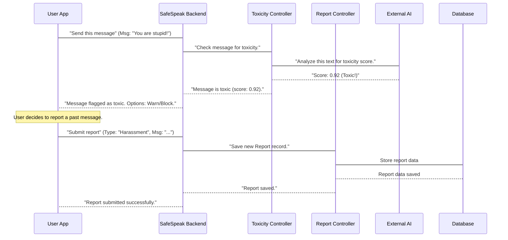

# Chapter 6: Content Safety (Toxicity & Reports)

In [Chapter 5: Emergency Services & Contacts](05_emergency_services___contacts_.md), we explored how SafeSpeak helps you in urgent real-world situations by connecting you with your trusted network. Now, let's shift our focus to keeping you safe _inside_ the SafeSpeak app itself, specifically when you're communicating with others.

Imagine you're in a school playground. There are rules about how students should talk to each other to ensure everyone feels safe and respected. What if someone starts saying hurtful things? You'd want a teacher or a monitor to step in, right? And if something bad happens, you'd want a way to tell an adult about it.

This is exactly what **Content Safety (Toxicity & Reports)** does for SafeSpeak. It acts as our "content monitor" and "feedback box." It helps keep conversations friendly and provides a way for you to report anything that makes you feel unsafe or uncomfortable.

## What Problem Does This System Solve?

In any communication app, there's a risk of people using harmful language, bullying, or even making threats. SafeSpeak is designed to be a safe space, so we need a way to:

1.  **Spot Bad Language Automatically:** Can we check messages for harmful words _before_ they even get seen by too many people? This helps prevent bullying and hate speech.
2.  **Allow Users to Report Issues:** What if our automatic system misses something, or if a user experiences harassment? We need a way for users to tell us directly about problems.

This system tackles these challenges. It aims to make SafeSpeak a respectful and secure platform for everyone.

Let's look at two key use cases:

- **Automatically checking a message for "toxicity"** (harmful language).
- **Allowing a user to submit a report** about a problem.

## Key Concepts of the System

This part of SafeSpeak involves two main ideas:

### 1. Toxicity Detection: Our Automatic "Language Checker"

This is like having a super-smart robot that reads messages and tells us if they contain harmful language.

- **What it is:** A process that analyzes text for "toxicity." Toxicity refers to anything rude, disrespectful, or unreasonable that could make someone want to leave a discussion. This includes insults, threats, hate speech, and more.
- **How it works:** SafeSpeak sends messages to an **external AI service** (like Google's Perspective API). This AI service is trained to understand human language and gives a "score" to how toxic a message is. A higher score means it's more likely to be harmful.
- **Why it's needed:** To prevent harmful content from spreading, or to warn users if their message might be perceived as toxic.

### 2. User Reports: Your "Feedback Box"

Even the smartest robots can miss things! This system makes sure you can always tell us if something is wrong.

- **What it is:** A way for users to directly report any concerns or issues they encounter. This could be about a specific message, a user's behavior, or anything else that violates SafeSpeak's safety rules.
- **How it works:** When you submit a report, SafeSpeak records all the details (what happened, who reported it, etc.) in its database. These reports are then logged for review by SafeSpeak administrators, ensuring that human eyes can look at serious issues.
- **Why it's needed:** It gives users a voice, helps catch problems the automatic system might miss, and ensures accountability.

## How SafeSpeak Uses It: Checking Messages & Submitting Reports

Let's see these concepts in action.

### Use Case 1: Checking a Message for Toxicity

Imagine you're about to send a message in SafeSpeak. Before it goes out, SafeSpeak can quickly check it for toxicity.

**Example Input (Your message):**

```json
{
  "message": "You are stupid!"
}
```

**Simplified Code (from `safespeak-Backend/controllers/toxicityController.js`):**

```javascript
// safespeak-Backend/controllers/toxicityController.js (simplified)
const axios = require("axios"); // Tool for making web requests

exports.checkToxicity = async (req, res) => {
  const { message } = req.body;
  try {
    const response = await axios.post(
      `https://commentanalyzer.googleapis.com/v1alpha1/comments:analyze?key=YOUR_API_KEY`,
      { comment: { text: message }, requestedAttributes: { TOXICITY: {} } }
    );
    const score = response.data.attributeScores.TOXICITY.summaryScore.value;
    res.json({ toxic: score > 0.7, score }); // 0.7 is an example threshold
  } catch (err) {
    res.status(500).json({ error: "Server error" });
  }
};
```

**Explanation:**

1.  SafeSpeak takes your message and sends it to the Perspective API (an external AI service) using `axios.post`.
2.  The AI analyzes the message and sends back a `score` (e.g., 0.9 for "very toxic", 0.1 for "not toxic at all").
3.  SafeSpeak then checks if this score is above a certain "toxic" level (like `0.7`).
4.  Finally, SafeSpeak tells your app if the message is considered toxic and what its score was. Your app can then decide whether to warn you, prevent the message from being sent, or take other actions.

**Example Output (What your app receives):**

```json
{
  "toxic": true,
  "score": 0.92 // High score means very toxic
}
```

**Explanation:** For the message "You are stupid!", the AI would likely give a high toxicity score, and SafeSpeak would report it as `toxic: true`. If the message was "Hello!", the score would be low, and `toxic` would be `false`.

### Use Case 2: Submitting a Report

If you see something inappropriate or experience harassment, you can submit a report.

**Example Input (Your report details):**

```json
{
  "reportType": "Harassment",
  "message": "User 'BullyBob' kept sending me hurtful messages after I asked them to stop.",
  "userId": "your_user_id_123" // Your ID (can be anonymous too)
}
```

**Simplified Code (from `safespeak-Backend/controllers/reportController.js`):**

```javascript
// safespeak-Backend/controllers/reportController.js (simplified)
const Report = require("../models/Report"); // Our Report blueprint

exports.submitReport = async (req, res) => {
  try {
    const { reportType, message, userId } = req.body;
    const report = new Report({ reportType, message, userId });
    await report.save(); // Save the new report to the database
    res.status(200).json({ success: true, message: "Report submitted" });
  } catch (err) {
    res.status(500).json({ error: err.message });
  }
};
```

**Explanation:**

1.  SafeSpeak takes the details of your report (what kind of issue it is, your description, and optionally your user ID).
2.  It creates a new `Report` record based on its blueprint (from [Chapter 2: Data Models](02_data_models_.md)).
3.  This `Report` record is saved into SafeSpeak's database for later review by administrators.

**Example Output (What your app receives):**

```json
{
  "success": true,
  "message": "Report submitted"
}
```

**Explanation:** Your SafeSpeak app gets a confirmation that your report has been successfully recorded.

## What Happens Under the Hood?

Let's visualize how SafeSpeak's content safety features work behind the scenes:



**Non-code Walkthrough:**

1.  **User Sends Message (Toxicity Check):** You type a message in the SafeSpeak app.
2.  **App Sends to Backend:** Your app sends this message to the SafeSpeak Backend.
3.  **Backend Routes to Toxicity Controller:** The backend immediately sends the message to the `Toxicity Controller`.
4.  **Toxicity Controller Contacts External AI:** The `Toxicity Controller` takes your message and sends it over the internet to the **External AI** (like Google's Perspective API), asking it to analyze the text for toxicity.
5.  **AI Analyzes and Responds:** The External AI analyzes the message and sends back a toxicity score (a number representing how harmful it thinks the message is).
6.  **Toxicity Controller Processes Result:** The `Toxicity Controller` receives the score. If the score is above a certain level, it marks the message as "toxic."
7.  **Backend Responds to App:** The backend tells your app whether the message was found to be toxic and its score. Your app can then use this information (e.g., show a warning, prevent sending, or notify you).

---

1.  **User Submits Report (User Reports):** You decide to report a user or a message you've seen. You fill out a report form in the app.
2.  **App Sends to Backend:** Your app sends the details of your report to the SafeSpeak Backend.
3.  **Backend Routes to Report Controller:** The backend sends this report request to the `Report Controller`.
4.  **Report Controller Saves to Database:** The `Report Controller` takes the report details and saves them as a new `Report` record in the `Database`.
5.  **Backend Confirms:** The backend then sends a confirmation back to your app, letting you know your report was successfully submitted and will be reviewed.

### Deeper Dive into Code Files

Let's look at the actual code files that make up this content safety system:

- **`safespeak-Backend/models/Report.js`**: This is the blueprint for storing details about each user report.

  ```javascript
  // safespeak-Backend/models/Report.js
  const mongoose = require("mongoose");

  const reportSchema = new mongoose.Schema({
    userId: { type: String, required: false }, // Optional for anonymous reports
    reportType: { type: String, required: true }, // e.g., "Harassment", "Threats"
    message: { type: String }, // Details of the report
    submittedAt: { type: Date, default: Date.now }, // When submitted
  });

  module.exports = mongoose.model("Report", reportSchema);
  ```

  **Explanation:** This `Report` [Data Model](02_data_models_.md) defines the structure for all user-submitted reports, ensuring essential information like `reportType` and `message` (the description) are captured, along with who submitted it (`userId`) and when.

- **`safespeak-Backend/controllers/toxicityController.js`**: This file contains the "brain" for checking messages for toxicity.

  ```javascript
  // safespeak-Backend/controllers/toxicityController.js (simplified)
  const axios = require("axios");
  const dotenv = require("dotenv");
  dotenv.config();

  exports.checkToxicity = async (req, res) => {
    const { message } = req.body;
    try {
      const response = await axios.post(
        `https://commentanalyzer.googleapis.com/v1alpha1/comments:analyze?key=${process.env.PERSPECTIVE_API_KEY}`,
        { comment: { text: message }, requestedAttributes: { TOXICITY: {} } }
      );
      const score = response.data.attributeScores.TOXICITY.summaryScore.value;
      res.json({ toxic: score > 0.7, score }); // Example threshold
    } catch (err) {
      console.error(err);
      res.status(500).json({ error: "Server error" });
    }
  };
  ```

  **Explanation:** This `checkToxicity` function uses `axios` to send a message to Google's Perspective API. It includes a secret `PERSPECTIVE_API_KEY` (stored securely and not directly in the code) to gain access to the AI service. It then takes the score returned by the AI and uses it to decide if the message is toxic. Note: While `Message.js` exists and could store `toxicityScore`, this `checkToxicity` function primarily serves to _return_ the score for the frontend app to decide on, rather than directly saving it with a message in the database.

- **`safespeak-Backend/controllers/reportController.js`**: This file handles submitting and retrieving user reports.

  ```javascript
  // safespeak-Backend/controllers/reportController.js (simplified)
  const Report = require("../models/Report"); // Our Report blueprint

  exports.submitReport = async (req, res) => {
    const { reportType, message, userId } = req.body;
    try {
      const report = new Report({ reportType, message, userId });
      await report.save(); // Save the new report to the database
      res.status(200).json({ success: true, message: "Report submitted" });
    } catch (err) {
      res.status(500).json({ error: err.message });
    }
  };

  // This is an example of an admin function to get reports
  exports.getUsersWithReports = async (req, res) => {
    // ... (complex database query for admin review) ...
    // Finds all users who have been reported
  };
  ```

  **Explanation:** `submitReport` directly takes the report details and creates a new `Report` entry in the database based on our `Report` model. The `getUsersWithReports` function is an example of what SafeSpeak administrators would use to view summarized report data.

- **`safespeak-Backend/routes/toxicityRoutes.js`**: This file defines the "pathway" for checking message toxicity.

  ```javascript
  // safespeak-Backend/routes/toxicityRoutes.js
  const express = require("express");
  const router = express.Router();
  const { checkToxicity } = require("../controllers/toxicityController");

  // Defines the web address for checking toxicity
  router.post("/check", checkToxicity);

  module.exports = router;
  ```

  **Explanation:** This sets up the `/check` pathway. When your SafeSpeak app sends a message to be checked for toxicity, it sends it to this address, which then calls the `checkToxicity` function we just saw.

- **`safespeak-Backend/routes/reportRoutes.js`**: This file defines the "pathway" for submitting user reports.

  ```javascript
  // safespeak-Backend/routes/reportRoutes.js
  const express = require("express");
  const router = express.Router();
  const {
    submitReport,
    getUsersWithReports,
  } = require("../controllers/reportController");

  // Defines the web address for submitting a new report
  router.post("/", submitReport);
  // Defines the web address for administrators to get users with reports
  router.get("/get-users-with-reports", getUsersWithReports);

  module.exports = router;
  ```

  **Explanation:** This sets up the main `/` pathway for submitting reports and `/get-users-with-reports` for admin review. When your SafeSpeak app sends a report, it hits the `/` address, which then calls the `submitReport` function.

## Conclusion

You've now learned about SafeSpeak's "content monitor" and "feedback box" – the **Content Safety (Toxicity & Reports)** system. This system uses smart AI to automatically check messages for harmful language and provides an essential way for users to report any issues they encounter. By doing so, SafeSpeak strives to maintain a respectful and secure communication environment for everyone, making sure both technology and human feedback contribute to your safety.

Now that we understand how SafeSpeak keeps content safe, let's look at how the app provides instant, live communication, connecting users in real-time. In the next chapter, we'll explore [Real-time Interactions (Socket.IO)](07_real_time_interactions__socket_io__.md).

---
