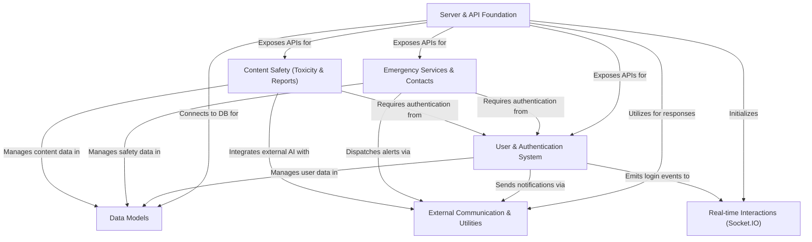

# Tutorial: SafeSpeak

SafeSpeak is a **personal safety application** designed to provide *immediate help in emergency situations* and ensure a *safe communication environment*. It allows users to send **SOS alerts** to their trusted contacts with their location, features *real-time content monitoring* for harmful language, and enables users to report concerns, all while securely managing user accounts and facilitating *instant updates* and interactions.

## Visual Overview

## Chapters

1. [Server & API Foundation
](01_server___api_foundation_.md)
2. [Data Models
](02_data_models_.md)
3. [External Communication & Utilities
](03_external_communication___utilities_.md)
4. [User & Authentication System
](04_user___authentication_system_.md)
5. [Emergency Services & Contacts
](05_emergency_services___contacts_.md)
6. [Content Safety (Toxicity & Reports)
](06_content_safety__toxicity___reports__.md)
7. [Real-time Interactions (Socket.IO)
](07_real_time_interactions__socket_io__.md)

---
