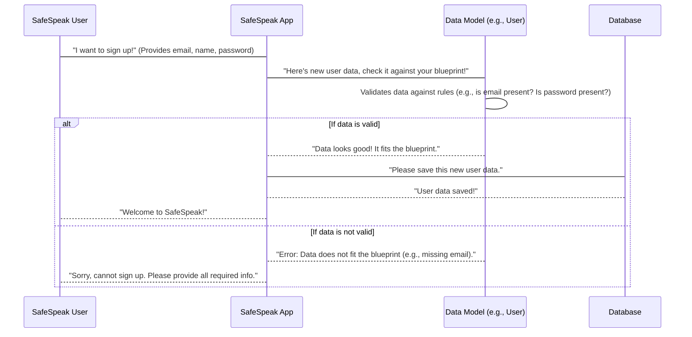

# Chapter 1: Data Models

Imagine you're building a brand new house. Before any bricks are laid or walls go up, you need a detailed plan, right? This plan, an architect's blueprint, shows exactly where each room is, how big it is, where the windows go, and what materials are needed. Without it, your house would be a messy pile of random stuff!

In the world of software, especially for a project like SafeSpeak that handles important information, we need something similar to these blueprints. We need a clear, organized way to store all the different pieces of information. For instance, when someone signs up for SafeSpeak, we need to save their email, their name, and a secure password. How do we make sure all this information is stored consistently and correctly every single time?

This is where **Data Models** come in!

## What are Data Models?

Think of Data Models as the "blueprints" for all the information SafeSpeak uses. They define exactly how different types of data should look when stored in our database.

Let's break it down:

1.  **A "Model" is a Blueprint:**

    - Each model represents a specific "thing" or "concept" in SafeSpeak. For example, there's a blueprint for a "User" (someone who uses SafeSpeak), a blueprint for an "Emergency Contact", or a blueprint for a "Message" someone sends.
    - Just like a house blueprint ensures every house built from it has a kitchen, a "User" model ensures every user record has an email.

2.  **"Fields" are the Details:**

    - Within each blueprint, you define "fields." These are the specific pieces of information you want to store.
    - For a "User" model, fields might include `email`, `displayName`, `password`, or `phone`.
    - For an "Emergency Contact," fields might be `name`, `phone`, or `relationship`.

3.  **"Rules" Keep Things Correct:**
    - Each field can have rules. These rules ensure the data is correct and complete.
    - Examples of rules:
      - `type: String`: This field must hold text.
      - `required: true`: This field absolutely _must_ have a value; it cannot be empty.
      - `unique: true`: The value in this field must be unique across all entries (like how no two users can have the exact same email).
      - `default: Date.now`: If no value is given, automatically fill it with the current date and time.

In SafeSpeak, we use a tool called `Mongoose` (which works with `MongoDB` databases) to create these blueprints. `Mongoose` helps us define these models easily.

## How SafeSpeak Uses Data Models

Let's take our example: storing information about a new user.

When a new user signs up for SafeSpeak, the application needs to save their details. It doesn't just throw the data into the database randomly. Instead, it uses the `User` Data Model as its guide.

Here's a simplified look at the `User` model blueprint:

```javascript
// safespeak-Backend/models/User.js
const mongoose = require("mongoose");

const userSchema = new mongoose.Schema({
  email: { type: String, required: true, unique: true },
  displayName: { type: String },
  password: { type: String, required: true },
  // ... other fields like phone, imageUrl, etc.
  createdAt: { type: Date, default: Date.now },
});

module.exports = mongoose.model("User", userSchema);
```

**Explanation:**

- `mongoose.Schema`: This is like picking up the blueprint paper.
- `email: { type: String, required: true, unique: true }`: This says: "Every user _must_ have an `email` (required), it must be text (String), and no two users can have the same email (unique)."
- `password: { type: String, required: true }`: "Every user _must_ have a `password` (required), and it must be text." (Note: In a real app, passwords are always stored in a scrambled, secure way, not plain text!)
- `createdAt: { type: Date, default: Date.now }`: "Automatically record the date and time when this user was created."

When SafeSpeak needs to save a new user, it creates an "instance" of this blueprint, fills in the details, and then saves it.

```javascript
// Imagine this code runs when a new user signs up
const User = require("../models/User"); // This gets our User blueprint

async function createNewUser(email, displayName, password) {
  try {
    const newUser = new User({
      email: email,
      displayName: displayName,
      password: password, // Remember: real apps hash this!
    });

    await newUser.save(); // Save this new user based on the blueprint rules
    console.log("New user saved successfully!");
  } catch (error) {
    console.error("Error saving user:", error.message);
  }
}

// Example: Trying to create a user
createNewUser("alice@example.com", "Alice Smith", "mySecretPass123");
// Output: New user saved successfully!

// Example: Trying to create a user without a required email
// createNewUser("", "Bob", "anotherPass");
// Output will show an error like "User validation failed: email: Path `email` is required."
```

In the example above, if you try to create a user without an email or password, `Mongoose` (using our `User` model blueprint) will stop you because those fields are marked `required: true`. This prevents incomplete or bad data from entering our database, keeping everything neat and reliable.

## What Happens Under the Hood?

When SafeSpeak interacts with data using these models, here's a simplified step-by-step process:



**Non-code Walkthrough:**

1.  **User Action:** A user performs an action, like signing up or adding an emergency contact. They provide some information.
2.  **App Receives:** The SafeSpeak application receives this information.
3.  **Model Lookup:** The app knows what kind of data it's dealing with (e.g., a "User" or an "EmergencyContact"). It "looks up" the corresponding Data Model (blueprint).
4.  **Validation:** The Data Model checks the information provided against its defined fields and rules. Is the `email` field present and of the correct type? Is the `phone` number for an emergency contact a string?
5.  **Data Processing:**
    - If everything matches the blueprint (all rules are followed), the Data Model prepares the data for storage.
    - If something doesn't match (e.g., a `required` field is missing), the Data Model will tell the app that there's an error.
6.  **Database Interaction:** If the data is valid, the SafeSpeak app sends the organized data to the database to be saved.
7.  **Confirmation:** The database confirms that the data has been stored, and the SafeSpeak app then confirms to the user that their action was successful. If there was an error, the app informs the user about it.

### Deeper Dive into Model Files

All SafeSpeak's data model blueprints live in the `safespeak-Backend/models/` folder. Each file usually defines one blueprint.

Let's look at `EmergencyContact.js` as another example:

```javascript
// safespeak-Backend/models/EmergencyContact.js
const mongoose = require("mongoose");

const emergencyContactSchema = new mongoose.Schema({
  userId: {
    type: mongoose.Schema.Types.ObjectId,
    ref: "User",
    required: true,
  },
  name: { type: String, required: true },
  relationship: { type: String },
  phone: { type: String },
  email: { type: String },
  // ... other fields
  createdAt: { type: Date, default: Date.now },
});

module.exports = mongoose.model("EmergencyContact", emergencyContactSchema);
```

**Key Points:**

- `userId: { type: mongoose.Schema.Types.ObjectId, ref: "User", required: true }`: This is super important! It tells us that every `EmergencyContact` **must** be linked to a specific `User`. The `type: mongoose.Schema.Types.ObjectId` means it's a special ID that refers to another entry in the database. The `ref: "User"` tells us _which_ other model it refers to – in this case, our `User` model blueprint. This is how different blueprints can be connected, just like a house blueprint might refer to a separate plumbing blueprint!
- `name: { type: String, required: true }`: Ensures every emergency contact has a name.

## Different Blueprints for Different Data

SafeSpeak uses many data models, each for a different kind of information:

| Model Name         | What it's a Blueprint for                         | Example Fields                     |
| :----------------- | :------------------------------------------------ | :--------------------------------- |
| `User`             | Information about a SafeSpeak user                | `email`, `displayName`, `password` |
| `EmergencyContact` | Information about a user's emergency contact      | `userId`, `name`, `phone`, `email` |
| `Message`          | Any message sent within SafeSpeak                 | `userId`, `text`, `toxicityScore`  |
| `Report`           | Details of a content safety report made by a user | `userId`, `reportType`, `message`  |
| `SOS`              | A distress signal sent by a user                  | `userId`, `location`, `sentAt`     |
| `Education`        | Educational content provided in the app           | `title`, `content`, `videoUrl`     |

Each of these models has its own specific fields and rules to keep SafeSpeak's data organized and reliable.

## Conclusion

You've just learned about Data Models, the essential "blueprints" that define how information is structured and stored in SafeSpeak. By using these models, we ensure that all data is consistent, correct, and easy to manage, just like an architect's plan keeps a building project on track. This foundational understanding is key to seeing how all the pieces of SafeSpeak fit together.

Now that we know how data is structured, let's dive into a crucial part of SafeSpeak: the people who use it! In the next chapter, we'll explore the [User & Authentication System](02_user___authentication_system_.md) and understand more about the `User` model in detail.

---
