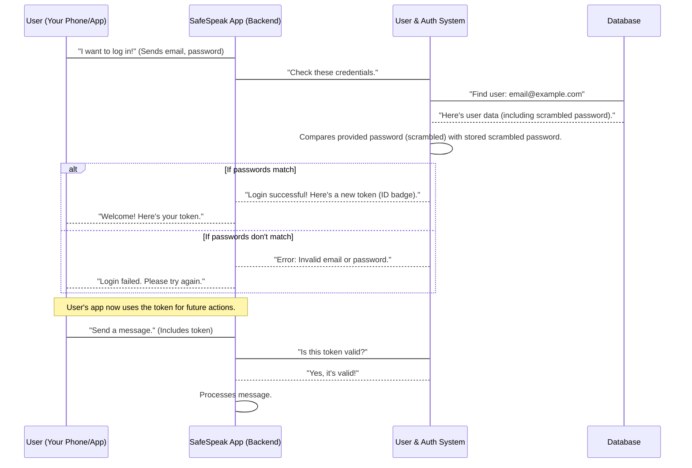

# Chapter 2: User & Authentication System

In [Chapter 1: Data Models](01_data_models_.md), we learned about the "blueprints" for all the information SafeSpeak uses. We saw how the `User` model acts as a blueprint for saving details like a user's email and password. But knowing _how_ to store user data is only half the battle!

Now, imagine you've built a beautiful house based on your blueprints. What's the next big thing you need? You need a way for people to _enter_ your house, and crucially, you need to know _who_ is entering and make sure only authorized people can access certain rooms.

This is exactly what the **User & Authentication System** does for SafeSpeak. It's like the "membership desk" where you sign up, and the "security checkpoint" that verifies your identity every time you want to do something important inside the app.

## What Problem Does This System Solve?

Think about any app you use daily – Facebook, Instagram, your banking app. Before you can do anything, you usually have to either:

1.  **Sign Up (Register):** Create a new account.
2.  **Log In:** Use an existing account to get access.

SafeSpeak is no different. It needs to know:

- **Who are you?** Are you Alice or Bob?
- **Are you really you?** How do we prevent someone from pretending to be you?
- **What are you allowed to do?** Can you send messages? Can you see other people's emergency contacts?

The User & Authentication System handles all these critical questions, ensuring that only legitimate and authorized users can access SafeSpeak's features, keeping everyone's data safe and private.

## Key Concepts of the System

Let's break down the important ideas behind this "membership desk" and "security checkpoint":

### 1. The "User" (You!)

At the heart of it is you! When you sign up for SafeSpeak, the system creates a "User" record using the `User` Data Model we discussed. This record holds your basic identity information.

### 2. Authentication: Proving Who You Are

Authentication is the process of proving that you are who you say you are.

- **Signing Up (Registration):** This is where you create your new "membership" with SafeSpeak. You provide an email and choose a password. The system takes this information, creates your User record, and secures your password.
- **Logging In:** When you want to use SafeSpeak again, you provide your email and password. The system checks if they match your stored record. If they do, you're "authenticated" – meaning, your identity is verified!

### 3. Digital Tokens: Your ID Badge

Once you're logged in, SafeSpeak doesn't ask for your password every single time you want to do something (like send a message or update your profile). That would be annoying! Instead, the system gives you a special "digital token."

Think of this token like a temporary ID badge or a ticket after you've passed the security checkpoint. Whenever you want to perform an action, you present this token. The system quickly checks your token to confirm you're still the authenticated user, without needing your password again. These tokens often expire after a while, like a temporary pass that needs to be renewed.

### 4. Firebase: Our Expert Security Guard

For some parts of user management, SafeSpeak uses a powerful tool called **Firebase**. Firebase is a service provided by Google that helps applications manage users, store data, and send messages very securely and efficiently.

SafeSpeak can use Firebase as an "external security guard" to handle some of the tricky parts of user accounts, like creating new users or verifying their identity. This frees up SafeSpeak's own backend to focus on other important tasks.

## How SafeSpeak Manages You: Sign Up & Log In

Let's see how you would interact with this system when you sign up and log in.

### Use Case 1: Signing Up

When you sign up for SafeSpeak, you'll provide your name, email, phone number, and choose a password.

**Example Input:**

- Name: `Alice Smith`
- Email: `alice@example.com`
- Password: `MySecurePass123`
- Phone: `123-456-7890`

**Simplified Code (from `safespeak-Backend/controllers/authController.js`):**

```javascript
// ... inside registerController
const { name, email, password, phone } = req.body; // Data from your signup form

// 1. Check if email already exists
const existingUser = await User.findOne({ email });
if (existingUser) {
  // ... handle error
}

// 2. Securely scramble your password (hashing)
const hashedPassword = await bcrypt.hash(password, 10);

// 3. Create a new User record using our blueprint from Chapter 1
const newUser = new User({
  displayName: name,
  email,
  password: hashedPassword, // Store the scrambled password
  phone,
  // ... other fields
});

// 4. Save the new user to the database
await newUser.save();

// 5. Generate a digital token (ID badge) for the new user
const token = jwt.sign({ id: newUser._id }, process.env.JWT_SECRET, {
  expiresIn: "7d",
});

// ... send success response with token
```

**Explanation:**

1.  SafeSpeak first checks if someone already signed up with that email.
2.  It then takes your password and scrambles it into a secret code (this is called "hashing"). This scrambled code is what gets saved, _not_ your actual password. This is a super important security step!
3.  A new `User` record is created based on the blueprint from [Chapter 1: Data Models](01_data_models_.md), using your provided information and the scrambled password.
4.  This `User` record is saved into SafeSpeak's database.
5.  Finally, SafeSpeak creates a temporary digital token for you. This token is your "ID badge" that tells the app you're logged in.

**Example Output (what your app receives):**

```json
{
  "success": true,
  "message": "User registered successfully",
  "data": {
    "token": "eyJhbGciOiJIUzI1Ni...", // Your digital token
    "user": {
      "id": "654321abcdef...", // Your unique user ID
      "name": "Alice Smith",
      "email": "alice@example.com",
      "phone": "123-456-7890"
    }
  }
}
```

### Use Case 2: Logging In

Once you have an account, you can log in to access SafeSpeak's features.

**Example Input:**

- Email: `alice@example.com`
- Password: `MySecurePass123`

**Simplified Code (from `safespeak-Backend/controllers/authController.js`):**

```javascript
// ... inside logIn controller
const { email, password } = req.body; // Data from your login form

// 1. Find the user in the database using their email
const user = await User.findOne({ email });
if (!user) {
  // ... handle "User not found" error
}

// 2. Compare the provided password with the scrambled one in the database
const isMatch = await bcrypt.compare(password, user.password);
if (!isMatch) {
  // ... handle "Invalid password" error
}

// 3. If passwords match, generate a new digital token for this session
const token = jwt.sign(
  { id: user._id, role: user.role },
  process.env.JWT_SECRET,
  { expiresIn: "7d" }
);

// ... send success response with token
```

**Explanation:**

1.  SafeSpeak looks up your user record in the database using your email.
2.  It then takes the password you entered and scrambles it in the same way. It compares this newly scrambled password with the scrambled password already stored in the database. It _never_ unscrambles your stored password! This keeps your password super secure.
3.  If the scrambled passwords match, you're successfully logged in! A new digital token is issued to you.

**Example Output:**

```json
{
  "success": true,
  "message": "Login successful",
  "data": {
    "token": "eyJhbGciOiJIUzI1Ni...", // Your new digital token
    "user": {
      "id": "654321abcdef...",
      "name": "Alice Smith"
    }
  }
}
```

### Use Case 3: Protecting Actions (Using Your ID Badge)

After logging in, every time your app wants to do something sensitive, like fetch your emergency contacts or send a message, it sends your digital token along with the request.

**Simplified Code (from `safespeak-Backend/middlewares/authMiddleware.js`):**

```javascript
// ... inside the authentication middleware
const authHeader = req.headers.authorization;

// 1. Check if the digital token is present in the request
if (!authHeader || !authHeader.startsWith("Bearer ")) {
  // ... handle "No token provided" error
}

const token = authHeader.split(" ")[1]; // Get the token part

try {
  // 2. Verify the token using a secret key
  const decoded = jwt.verify(token, process.env.JWT_SECRET);
  req.user = decoded; // Store user info from token for later use
  next(); // Allow the request to continue to its destination
} catch (err) {
  // ... handle "Invalid token" error
}
```

**Explanation:**

1.  When your app makes a request for a protected action, it attaches your digital token to the request.
2.  A special "security guard" piece of code (called "middleware") intercepts the request. It checks if the token is valid and hasn't been tampered with.
3.  If the token is valid, the request is allowed to proceed. If not, access is denied. This ensures only logged-in users can perform certain actions.

## What Happens Under the Hood?

Let's look at a simplified step-by-step process of how SafeSpeak's User & Authentication System works, especially during login:



**Non-code Walkthrough:**

1.  **User Action:** You open the SafeSpeak app and try to log in, entering your email and password.
2.  **App Sends Request:** Your SafeSpeak app sends this information securely to the SafeSpeak Backend.
3.  **User & Auth System Processes:** The backend directs the login request to its User & Authentication System.
4.  **Database Check:** The system looks up your email in the database to find your user record, which includes your securely scrambled password.
5.  **Password Verification:** The system takes the password you just entered, scrambles it, and compares it to the scrambled password retrieved from the database. It's like checking if two secret codes match.
6.  **Token Issuance (or Error):**
    - If the passwords match, the system confirms your identity and issues you a new digital token. This token is a small piece of data that proves you're logged in.
    - If they don't match, the system sends an error back.
7.  **Access Granted:** If successful, your SafeSpeak app receives the token and can now use it like an ID badge to access protected features of the application. For any future action (like sending a message), the app simply includes this token. The backend will quickly verify the token, allowing you to proceed.

### Deeper Dive into Code Files

Let's look at where these concepts come to life in SafeSpeak's code:

- **`safespeak-Backend/models/User.js`**: This is our `User` blueprint from [Chapter 1: Data Models](01_data_models_.md), where we define what information each user record should hold.

  ```javascript
  // safespeak-Backend/models/User.js
  const mongoose = require("mongoose");

  const userSchema = new mongoose.Schema({
    email: { type: String, required: true, unique: true },
    displayName: { type: String },
    password: { type: String, required: true }, // This stores the scrambled password
    phone: { type: String },
    // ... other user details
    createdAt: { type: Date, default: Date.now },
  });

  module.exports = mongoose.model("User", userSchema);
  ```

  This file defines the structure for storing user data, including the `password` field which will hold the _hashed_ (scrambled) password.

- **`safespeak-Backend/config/firebase.js`**: This file sets up our connection to Firebase, allowing SafeSpeak to use Firebase's services for authentication.

  ```javascript
  // config/firebase.js
  const admin = require("firebase-admin");
  const serviceAccount = require("../firebaseServiceAccount.json");

  // Initialize Firebase Admin SDK
  admin.initializeApp({
    credential: admin.credential.cert(serviceAccount),
    // ... other settings
  });

  const auth = admin.auth(); // This gives us access to Firebase's authentication features
  // const messaging = admin.messaging(); // For sending notifications
  module.exports = auth; // Exporting Firebase Auth for use in other files
  ```

  This code initializes the Firebase Admin SDK, specifically giving us access to `admin.auth()`, which is Firebase's tool for managing users.

- **`safespeak-Backend/controllers/authController.js`**: This file contains the "brain" for handling signup and login requests. It uses the `User` model and interacts with password hashing tools (`bcryptjs`) and token generation (`jsonwebtoken`).

  ```javascript
  // safespeak-Backend/controllers/authController.js
  const User = require("../models/User"); // Our User blueprint
  const auth = require("../config/firebase"); // Firebase auth tool
  const bcrypt = require("bcryptjs"); // For scrambling passwords
  const jwt = require("jsonwebtoken"); // For creating digital tokens

  module.exports = (io) => ({
    // Handles user registration (signup)
    registerController: async (req, res) => {
      const { name, email, password } = req.body;
      // Check if email exists, hash password, create new User in DB, generate token...
      // ... (as shown in the simplified "Signing Up" example) ...
    },

    // Handles user login
    logIn: async (req, res) => {
      const { email, password } = req.body;
      // Find user, compare passwords, generate token...
      // ... (as shown in the simplified "Logging In" example) ...
    },

    // Example of Firebase authentication (alternative login/signup)
    firebaseAuth: async (req, res) => {
      const token = req.headers.authorization.split(" ")[1];
      const decodedToken = await auth.verifyIdToken(token); // Firebase verifies token
      // Create or update User in our DB based on Firebase data
      // ...
    },
  });
  ```

  This controller is where the actual logic for creating users, verifying passwords, and issuing tokens resides. It combines the `User` blueprint, Firebase tools, and security libraries.

- **`safespeak-Backend/middlewares/authMiddleware.js`**: This file contains the "security guard" code that checks your digital token before allowing access to protected parts of the app.

  ```javascript
  // safespeak-Backend/middlewares/authMiddleware.js
  const jwt = require("jsonwebtoken"); // For verifying digital tokens

  module.exports = (req, res, next) => {
    const authHeader = req.headers.authorization;
    if (!authHeader || !authHeader.startsWith("Bearer ")) {
      return res.status(401).json({ error: "Unauthorized: No token provided" });
    }

    const token = authHeader.split(" ")[1]; // Get the token part

    try {
      const decoded = jwt.verify(token, process.env.JWT_SECRET); // Verify token
      req.user = decoded; // Attach user info to the request
      next(); // Allow request to proceed
    } catch (err) {
      return res.status(403).json({ error: "Forbidden: Invalid token" });
    }
  };
  ```

  This middleware acts as a gatekeeper. Any request that needs to be protected will first pass through this code, which ensures a valid digital token (ID badge) is presented.

- **`safespeak-Backend/routes/authRoutes.js`**: This file defines the "pathways" (web addresses) that your app uses to talk to the User & Authentication System.

  ```javascript
  // safespeak-Backend/routes/authRoutes.js
  const express = require("express");

  module.exports = (io) => {
    const router = express.Router();
    const authController = require("../controllers/authController")(io);

    router.post("/signup", authController.firebaseSignup); // Pathway for Firebase signup
    router.post("/login", authController.logIn); // Pathway for traditional login
    router.post("/register", authController.registerController); // Pathway for traditional register

    return router;
  };
  ```

  This code sets up the web addresses (like `/login` or `/register`) that your SafeSpeak app will send requests to when you sign up or log in. It connects these addresses to the specific functions in `authController.js`.

## Conclusion

You've now seen how SafeSpeak manages its users, from the moment you sign up to how your identity is verified every time you use the app. The User & Authentication System, using our `User` Data Model, secure password handling, digital tokens, and even powerful external services like Firebase, acts as a crucial "membership desk" and "security checkpoint" to keep SafeSpeak secure and ensure only authorized users can access its features.

Now that we understand who is using SafeSpeak and how they get access, let's look at how SafeSpeak talks to the outside world and provides various helpful functions. In the next chapter, we'll explore [External Communication & Utilities](03_external_communication___utilities_.md).

---
