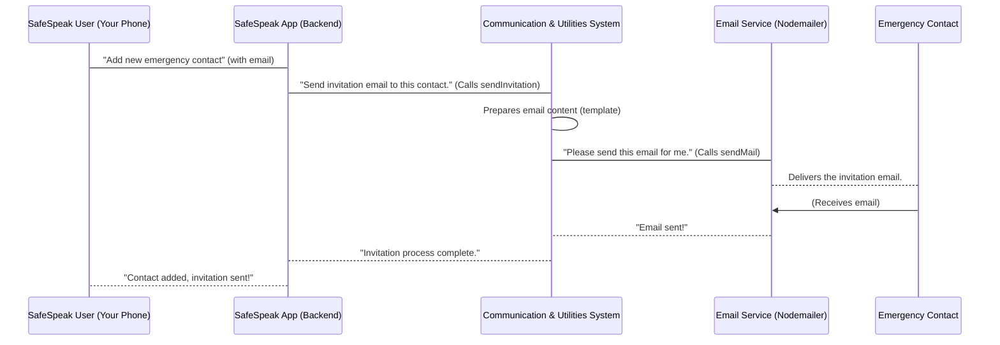

# Chapter 3: External Communication & Utilities

In [Chapter 2: User & Authentication System](02_user___authentication_system_.md), we learned how SafeSpeak manages its users and ensures only authorized people can access the app. Now that users can securely log in, SafeSpeak often needs to "talk" to them or other services _outside_ the main application flow.

Imagine SafeSpeak is like a busy office building. We've just set up the security desk (User & Authentication) so we know who's coming and going. But what about sending out important mail, making phone calls, or sending packages? This is where the **External Communication & Utilities** system comes in! It's like the office's "communication department" and "toolkit" combined.

## What Problem Does This System Solve?

Think about how SafeSpeak helps you. If you add an emergency contact, that person needs to be invited to the app. If there's an emergency, you might need to send a quick alert to your phone. These actions require SafeSpeak to reach out beyond its own walls.

This system handles all those important outgoing messages and provides helpful tools for common tasks. It ensures:

- **You stay informed:** Get urgent alerts or important updates.
- **Your emergency contacts are connected:** They receive invitations to join and help keep you safe.
- **The app runs smoothly:** By having a consistent way to format responses or perform small, repeated tasks.

Let's use a clear example: **Sending an invitation email to a new emergency contact.** This is a prime example of "external communication" that relies on these utilities.

## Key Concepts of the System

This part of SafeSpeak is split into two main areas:

### 1. External Communication: Talking to the Outside World

This is about sending messages _from_ SafeSpeak _to_ people or other services.

- **Emails:** Imagine SafeSpeak needs to send an invitation, a password reset link, or a welcome message. It uses a special "mail delivery service" (powered by `Nodemailer`) to reliably send these emails.
- **Push Notifications:** These are those little pop-up messages that appear on your phone, even when you're not using the app (like a breaking news alert). SafeSpeak uses **Firebase Cloud Messaging (FCM)** as a "megaphone" to send urgent alerts, like an SOS signal, directly to your phone.

### 2. Utilities: The App's Handy Toolkit

These are small, reusable tools and functions that help different parts of SafeSpeak work efficiently.

- **`responseWrapper`:** Imagine every department in our office building has a standard way to write memos. `responseWrapper` does something similar for our app. It's a "standard form" that ensures every message SafeSpeak sends back to your phone (after you do something, like log in) has the same clear structure (e.g., `success`, `message`, `data`). This makes it easy for your phone app to understand the response.
- **Other Helpers:** There might be other small, specialized tools here, like functions that format text, handle dates, or perform simple calculations, making the overall code cleaner and easier to manage.

## How SafeSpeak Sends Invitations

Let's walk through our example: **sending an invitation email to a new emergency contact.**

When you add a new emergency contact in SafeSpeak (we'll dive into _how_ you add them in [Chapter 4: Emergency Services & Contacts](04_emergency_services___contacts_.md)), the app needs to send them an email inviting them to join.

**Example Input (when adding a contact):**

- Name: `John Doe`
- Email: `john.doe@example.com`
- A special link to set their password.

**Simplified Code (What SafeSpeak does to send the invite):**

```javascript
// Imagine this code runs when you add a new emergency contact
const sendInvitation = require("../utils/sendInvitation"); // Our invitation tool

async function sendContactInvitation(
  contactName,
  contactEmail,
  passwordResetLink
) {
  try {
    await sendInvitation({
      name: contactName,
      email: contactEmail,
      resetLink: passwordResetLink,
    });
    console.log("Invitation sent successfully!");
  } catch (error) {
    console.error("Error sending invitation:", error.message);
  }
}

// Example: Inviting John Doe
sendContactInvitation(
  "John Doe",
  "john.doe@example.com",
  "https://safespeak.app/reset-pass/abc123def"
);
// Output: Invitation sent successfully! (And John Doe receives an email)
```

**Explanation:**

This simple piece of code uses our `sendInvitation` "tool." You just tell it the contact's name, email, and the special link, and it handles all the complicated steps of preparing and sending the email.

## What Happens Under the Hood?

Let's see how our "communication department" handles sending an invitation email:



**Non-code Walkthrough:**

1.  **User Action:** You use your SafeSpeak app to add a new emergency contact, providing their name and email.
2.  **App Receives:** The SafeSpeak backend receives this request.
3.  **Calls Communication System:** The backend knows it needs to send an invitation email, so it asks the "Communication & Utilities System" to do this.
4.  **Prepare Email:** Within the Communication & Utilities System, a specific function (like `sendInvitation`) is used. This function prepares the email, putting together a friendly message, the app download link, and the special password setup link.
5.  **Use Mail Delivery Service:** The `sendInvitation` function then hands over the prepared email to a specialized "mail delivery service" (the `sendMail` utility, which uses `Nodemailer`).
6.  **Email Sent:** The mail delivery service connects to an external email server (like Gmail's mail server) and sends the email.
7.  **Contact Receives:** The emergency contact receives the invitation in their inbox!
8.  **Confirmation:** The mail delivery service confirms to SafeSpeak that the email was sent, and SafeSpeak then confirms to you that the contact was added and the invitation was sent.

### Deeper Dive into Code Files

Let's look at the actual code files that make up this "communication department" and "toolkit":

- **`safespeak-Backend/utils/sendMail.js`**: This is our core "mail delivery service." It's responsible for the actual sending of emails using `Nodemailer`.

  ```javascript
  // safespeak-Backend/utils/sendMail.js
  const nodemailer = require("nodemailer");

  const sendMail = async (to, subject, html) => {
    // 1. Set up how we connect to the email server (like knowing the post office address)
    const transporter = nodemailer.createTransport({
      host: "smtp.gmail.com",
      port: 587,
      secure: false,
      auth: {
        user: process.env.EMAIL_USER, // Our SafeSpeak email address
        pass: process.env.EMAIL_PASS, // Our SafeSpeak email password (kept secret!)
      },
    });

    // 2. Send the actual email
    await transporter.sendMail({
      from: `"SafeSpeak 🔐" <${process.env.EMAIL_USER}>`, // Who the email is from
      to, // Who the email is going to
      subject, // The email subject line
      html, // The full email content (can be fancy HTML)
    });
  };

  module.exports = sendMail;
  ```

  **Explanation:** This file sets up a `transporter` (think of it as our email-sending machine) using `nodemailer` and then uses it to `sendMail` to the recipient with the specified subject and HTML content. It needs our email account details (stored securely as `process.env.EMAIL_USER` and `process.env.EMAIL_PASS`) to log into an email server.

- **`safespeak-Backend/utils/sendInvitation.js`**: This file _uses_ the `sendMail` utility to create a specific kind of email: an invitation.

  ```javascript
  // safespeak-Backend/utils/sendInvitation.js
  const sendMail = require("./sendMail"); // Import our mail delivery service

  const sendInvitation = async ({ name, email, resetLink }) => {
    const appLink = "https://we.tl/t-C48T8iPC1G"; // Link to download SafeSpeak app

    // 1. Build the email's content using HTML
    const htmlContent = `
      <h2>📲 You're Invited to Join SafeSpeak!</h2>
      <p>Hi ${name || "there"},</p>
      <p>You've been added as an emergency contact on <strong>SafeSpeak</strong>.</p>
      <p>
        <a href="${appLink}" style="...">🔽 Download SafeSpeak App</a>
      </p>
      <p>Please <a href="${resetLink}">click here to set your password</a>.</p>
      <p>Thanks,<br/>The SafeSpeak Team 🔐</p>
    `;

    // 2. Call our mail delivery service to send this invitation
    await sendMail(email, "📩 You're Invited to Join SafeSpeak!", htmlContent);
  };

  module.exports = sendInvitation;
  ```

  **Explanation:** This `sendInvitation` function takes details like `name`, `email`, and `resetLink`. It then crafts a professional-looking email message (using HTML for formatting) and passes it, along with the recipient's email and subject, to our `sendMail` utility.

- **`safespeak-Backend/utils/sendNotification.js`**: This file handles sending those quick "push notifications" to phones using Firebase Cloud Messaging (FCM).

  ```javascript
  // safespeak-Backend/utils/sendNotification.js
  const axios = require("axios"); // Tool for making web requests

  exports.sendPushNotification = async ({ to, title, body, data }) => {
    try {
      const serverKey = process.env.FCM_SERVER_KEY; // Secret key for Firebase
      await axios.post(
        "https://fcm.googleapis.com/fcm/send", // Firebase's special address
        {
          to, // To whom (a phone's unique ID)
          notification: { title, body }, // What the notification says
          data, // Extra info the app can use
        },
        {
          headers: {
            "Content-Type": "application/json",
            Authorization: `key=${serverKey}`, // Our permission to send
          },
        }
      );
    } catch (err) {
      console.error("❌ Failed to send push notification:", err.message);
    }
  };
  ```

  **Explanation:** This function uses `axios` (a tool for sending requests over the internet) to talk to Google's Firebase Cloud Messaging (FCM) service. It sends a message to FCM, telling it what notification to deliver (`title`, `body`) and to which device (`to`), using a special `serverKey` as permission. FCM then takes care of delivering the message to the user's phone.

- **`safespeak-Backend/helper/responseWrapper.js`**: This is a key "utility" function that helps standardize how SafeSpeak sends messages back to your app.

  ```javascript
  // safespeak-Backend/helper/responseWrapper.js
  function responseWrapper(success, message, status, data, error) {
    return {
      success, // Was the action successful? (true/false)
      message, // A short message for the user (e.g., "Login successful")
      status: status ?? 500, // HTTP status code (e.g., 200 for OK, 400 for error)
      data: data ?? null, // Any useful information (e.g., user profile)
      error: error ?? null, // Details if something went wrong
    };
  }

  module.exports = { responseWrapper };
  ```

  **Explanation:** This function is like a template for all responses. Instead of different parts of SafeSpeak sending back responses in various ways, they all use `responseWrapper`. This ensures that your SafeSpeak app always receives information in the same, easy-to-understand format, making the app itself much easier to build and manage.

## Conclusion

You've just learned about SafeSpeak's "communication department" and "toolkit" – the **External Communication & Utilities** system. This vital part of the application handles sending important messages like email invitations and push notifications, ensuring SafeSpeak can reach out to you and your contacts. It also provides useful helper functions, like `responseWrapper`, that keep the app's internal operations neat and tidy.

Now that we know how SafeSpeak communicates outside its walls, let's dive into one of its most important core features: how it handles emergencies and manages your safety network. In the next chapter, we'll explore [Emergency Services & Contacts](04_emergency_services___contacts_.md).

---
