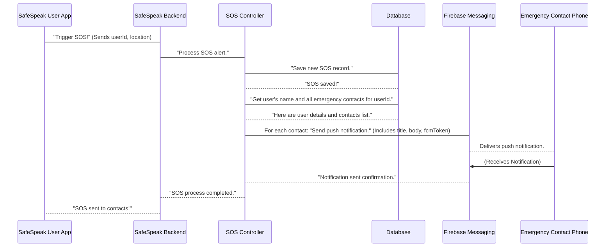

# Chapter 4: Emergency Services & Contacts

In [Chapter 3: External Communication & Utilities](03_external_communication___utilities_.md), we learned how SafeSpeak "talks" to the outside world, sending important messages like invitation emails and urgent push notifications. Now, let's explore _what_ makes those urgent messages so crucial: SafeSpeak's core safety feature, the **Emergency Services & Contacts** system.

Imagine you're in a tricky situation and need help right away. Fumbling through your phone to find numbers or type out a message takes precious time. SafeSpeak solves this problem by acting like a **personal safety network** at your fingertips. It's a "panic button" combined with a specialized "address book" for urgent situations.

## What Problem Does This System Solve?

SafeSpeak is designed to keep you safe. In an emergency, you need two things:

1.  **Quick Alert:** A super-fast way to signal for help.
2.  **Trusted Helpers:** A predefined group of people who will know what to do and where you are.

This system directly addresses these needs. It allows you to:

- **Store Trusted Contacts:** Keep a list of people you trust (family, friends, guardians) who you want to be notified in an emergency.
- **Send SOS Alerts:** With just a tap, send a distress signal with your current location to all your trusted contacts.
- **Ensure Quick Response:** The system handles sending these alerts instantly, aiming for the fastest possible help when you need it most.

Let's focus on the most critical use case: **Sending an SOS alert with your location to your emergency contacts.**

## Key Concepts of the System

This system brings together two vital components:

### 1. Emergency Contacts: Your Safety Network

Think of this as your personal "safety address book." These are the people you've chosen to be your first responders in an emergency.

- **Who they are:** Each emergency contact is a record stored in SafeSpeak's database. Just like the `User` model, we have an `EmergencyContact` [Data Model](01_data_models_.md) defining how this information is structured.
- **What information is stored:** Name, phone number, email, and importantly, who _you_ are (the `userId` linking them to your account).
- **How they are managed:** You can add new contacts, see your list of contacts, update their details, or remove them, just like managing entries in a regular address book.
- **Linking to Users:** When you add a contact, SafeSpeak might even create a basic `User` account for them if they don't already have one, making it easier for them to join SafeSpeak and receive alerts.

### 2. SOS Alerts: The Panic Button

This is the core "distress signal" functionality.

- **Triggering an SOS:** When you activate the SOS feature, SafeSpeak captures your current location and the time.
- **Saving the Record:** This emergency event (the SOS) is saved in SafeSpeak's database using the `SOS` [Data Model](01_data_models_.md). This creates a log of the incident.
- **Notifying Contacts:** Immediately after saving, SafeSpeak reaches out to all your designated emergency contacts. It uses the [External Communication & Utilities](03_external_communication___utilities_.md) system, specifically **push notifications**, to send an urgent alert directly to their phones.

## How SafeSpeak Helps You: Sending an SOS

Let's walk through the main use case: triggering and sending an SOS alert.

Imagine you're using the SafeSpeak app, and you tap the "SOS" button.

**Example Input (What your app sends to SafeSpeak):**

The SafeSpeak app on your phone will automatically gather your User ID, your current location (like GPS coordinates or an address), and the current time.

```json
{
  "userId": "user_alice_123",
  "location": "34.0522,-118.2437 (Los Angeles, CA)",
  "timestamp": "2023-10-27T10:30:00Z"
}
```

**Explanation:**
This is the information your phone sends to the SafeSpeak backend when you hit the SOS button. It tells the system who you are, where you are, and when you triggered the alert.

**Simplified Code (What SafeSpeak's backend does to send the SOS):**

The code snippet below is from the `sendSOS` function in `safespeak-Backend/controllers/sosController.js`. It shows the main steps the backend takes.

```javascript
// From safespeak-Backend/controllers/sosController.js
const SOS = require("../models/SOS"); // Our SOS blueprint
const EmergencyContact = require("../models/EmergencyContact"); // Our Emergency Contact blueprint
const User = require("../models/User"); // Our User blueprint
const messaging = require("../config/firebase"); // For sending push notifications

exports.sendSOS = async (req, res) => {
  const { userId, location, timestamp } = req.body;

  // 1. Create a new SOS record in the database
  const sos = new SOS({ userId, location, sentAt: timestamp });
  await sos.save();

  // 2. Get the user's display name for the alert message
  const user = await User.findById(userId);

  // 3. Find all emergency contacts linked to this user
  const contacts = await EmergencyContact.find({ userId });

  // 4. Go through each contact and send a push notification
  for (const contact of contacts) {
    if (contact.fcmToken) {
      // Only send if the contact has a device token
      const message = {
        notification: {
          title: `SOS Alert from ${user.displayName}`,
          body: `Location: ${location}. Immediate help may be needed.`,
        },
        token: contact.fcmToken, // The contact's device token for notifications
      };
      // Send the notification using Firebase Messaging
      messaging.send(message); // This sends the actual pop-up alert
    }
  }
  res.status(200).json({ success: true, message: "SOS sent!" });
};
```

**Explanation:**

1.  **Save SOS:** First, SafeSpeak creates a new `SOS` record in its database, logging your alert with your ID, location, and time.
2.  **Get User Info:** It then quickly looks up your name so that your contacts know who the alert is from.
3.  **Find Contacts:** Next, it finds all the `EmergencyContact` records that you have added to your safety network.
4.  **Send Notifications:** For each of your emergency contacts who has allowed push notifications (indicated by an `fcmToken`), SafeSpeak prepares a personalized alert message and uses the Firebase Messaging service (part of [External Communication & Utilities](03_external_communication___utilities_.md)) to send it directly to their phone.

**Example Output (What happens after the SOS is sent):**

- **To your app:**
  ```json
  {
    "success": true,
    "message": "SOS sent to emergency contacts"
  }
  ```
  **Explanation:** Your SafeSpeak app receives a confirmation that your SOS alert has been processed and sent out.
- **To your Emergency Contacts' phones:**
  They receive a pop-up notification like this:
  "**SOS Alert from Alice Smith**\
  Location: 34.0522,-118.2437 (Los Angeles, CA). Immediate help may be needed."
  **Explanation:** This urgent notification appears on their phone, even if their SafeSpeak app is closed, letting them know you need help and where you are.

## What Happens Under the Hood?

Let's visualize the step-by-step process when you send an SOS alert:



**Non-code Walkthrough:**

1.  **User Action:** You're in your SafeSpeak app and activate the SOS feature (e.g., holding down a button, shaking the phone).
2.  **App Sends Request:** Your phone app immediately collects your User ID and your current geographical location, and sends this information to the SafeSpeak Backend.
3.  **Backend Routes Request:** The backend receives this critical request and sends it to the `SOS Controller` which is responsible for handling emergency alerts.
4.  **Save SOS Log:** The `SOS Controller` first records this emergency event in the `Database`. This creates a history of your alerts.
5.  **Retrieve Information:** The controller then asks the `Database` for your name (to personalize the alert) and, crucially, for the list of all your registered `Emergency Contacts`.
6.  **Loop and Notify:** The `SOS Controller` goes through each emergency contact on your list. For every contact who has a registered device (meaning they can receive push notifications), it prepares an urgent message.
7.  **Send Push Notification:** Each prepared message is then sent to `Firebase Messaging`, which is Google's powerful service for delivering push notifications. This is part of SafeSpeak's [External Communication & Utilities](03_external_communication___utilities_.md).
8.  **Contact Receives:** Firebase Messaging quickly delivers the SOS alert as a pop-up notification directly to your emergency contact's phone, even if their SafeSpeak app is not open.
9.  **Confirmation:** Firebase Messaging confirms delivery, and eventually, the SafeSpeak Backend confirms to your app that the SOS was successfully sent.

### Deeper Dive into Code Files

Let's look at the specific files that bring the Emergency Services & Contacts system to life:

- **`safespeak-Backend/models/EmergencyContact.js`**: This is the blueprint for storing details about each of your emergency contacts.

  ```javascript
  // safespeak-Backend/models/EmergencyContact.js
  const mongoose = require("mongoose");

  const emergencyContactSchema = new mongoose.Schema({
    userId: {
      type: mongoose.Schema.Types.ObjectId, // Connects this contact to a specific user
      ref: "User", // Refers to the 'User' Data Model
      required: true,
    },
    name: { type: String, required: true },
    relationship: { type: String },
    phone: { type: String },
    email: { type: String },
    fcmToken: { type: String, default: "" }, // Device token for push notifications
    linkedUserId: {
      // If this contact is also a SafeSpeak user
      type: mongoose.Schema.Types.ObjectId,
      ref: "User",
      default: null,
    },
    createdAt: { type: Date, default: Date.now },
  });

  module.exports = mongoose.model("EmergencyContact", emergencyContactSchema);
  ```

  **Explanation:** This `EmergencyContact` [Data Model](01_data_models_.md) defines what information is stored for each emergency contact. Notice `userId` which links the contact to you, and `fcmToken` which is the unique identifier for their phone, used for sending push notifications. `linkedUserId` can link them to an actual SafeSpeak `User` account if they also use the app.

- **`safespeak-Backend/models/SOS.js`**: This is the blueprint for logging each time an SOS alert is sent.

  ```javascript
  // safespeak-Backend/models/SOS.js
  const mongoose = require("mongoose");

  const sosSchema = new mongoose.Schema({
    userId: { type: String, required: true }, // The ID of the user who sent the SOS
    location: { type: String }, // Where the SOS was sent from
    sentAt: { type: Date, default: Date.now }, // When the SOS was sent
  });

  module.exports = mongoose.model("SOS", sosSchema);
  ```

  **Explanation:** This simple `SOS` [Data Model](01_data_models_.md) ensures that every SOS event is recorded with the user's ID, their location, and the exact time it was sent. This is crucial for tracking and auditing emergency situations.

- **`safespeak-Backend/controllers/userController.js`**: This file contains the functions for managing your emergency contacts.

  ```javascript
  // From safespeak-Backend/controllers/userController.js
  const EmergencyContact = require("../models/EmergencyContact");
  const User = require("../models/User"); // Our User blueprint
  const sendInvitation = require("../utils/sendInvitation"); // From Chapter 3
  const admin = require("firebase-admin"); // For Firebase Authentication

  // Adding an emergency contact
  exports.addEmergencyContact = async (req, res) => {
    const { userId } = req.params;
    const { name, email, phone, relationship } = req.body;

    // 1. Check if a user already exists with this email/phone (optional)
    let existingUser = await User.findOne({ $or: [{ email }, { phone }] });
    if (!existingUser) {
      // If not, automatically create a new user for this contact
      existingUser = await User.create({
        displayName: name,
        email,
        phone,
        // ... other fields, potentially a temp password
      });
      // Generate a password reset link for them (from Firebase)
      const resetLink = await admin.auth().generatePasswordResetLink(email);
      // Send them an invitation email (from Chapter 3)
      await sendInvitation({ name, email, resetLink });
    }

    // 2. Create the emergency contact record, linking to existing/new user
    const contact = await EmergencyContact.create({
      userId, // Link to *your* user ID
      name,
      email,
      phone,
      relationship,
      linkedUserId: existingUser._id, // Link to *their* user ID
    });

    res.status(201).json({ message: "Contact added!" });
  };

  // Getting all emergency contacts for a user
  exports.getEmergencyContacts = async (req, res) => {
    const { userId } = req.params;
    const contacts = await EmergencyContact.find({ userId }); // Find contacts linked to your ID
    res.status(200).json({ contacts });
  };
  // ... (There are also functions for updateEmergencyContact, deleteEmergencyContact)
  ```

  **Explanation:**

  - `addEmergencyContact`: This function handles when you add a new person to your emergency contacts. It first checks if that person already has a SafeSpeak account. If not, it can automatically create a basic `User` account for them (making it easier for them to receive alerts) and sends them an invitation email (using the `sendInvitation` utility from [Chapter 3: External Communication & Utilities](03_external_communication___utilities_.md)). Finally, it creates the `EmergencyContact` record, linking it both to your user ID and optionally to their newly created user ID.
  - `getEmergencyContacts`: This function simply fetches all the `EmergencyContact` records that are linked to your `userId`, allowing your app to display your safety network.

- **`safespeak-Backend/controllers/sosController.js`**: This file contains the `sendSOS` function, which we discussed earlier, responsible for handling the SOS alert process.

  ```javascript
  // From safespeak-Backend/controllers/sosController.js (simplified)
  const { sendPushNotification } = require("../utils/sendNotification"); // Our notification tool (from Chapter 3)
  const SOS = require("../models/SOS");
  const EmergencyContact = require("../models/EmergencyContact");
  const User = require("../models/User");
  const messaging = require("../config/firebase"); // Firebase messaging service

  exports.sendSOS = async (req, res) => {
    const { userId, location, timestamp } = req.body;

    const sos = new SOS({ userId, location, sentAt: timestamp });
    await sos.save(); // Save the SOS record

    const user = await User.findById(userId); // Get user's name
    const contacts = await EmergencyContact.find({ userId }); // Get contacts

    for (const contact of contacts) {
      if (contact.fcmToken) {
        const message = {
          notification: {
            title: `SOS Alert from ${user.displayName}`,
            body: `Location: ${location}. Immediate help may be needed.`,
          },
          token: contact.fcmToken,
        };
        messaging.send(message); // Send the notification via Firebase
      }
    }
    res.status(200).json({ success: true, message: "SOS sent!" });
  };
  ```

  **Explanation:** This snippet is the "brain" for the SOS button. It logs the event, finds the right people to notify, and then sends personalized push notifications to each of them using Firebase's messaging service, ensuring they get the urgent alert on their device.

- **`safespeak-Backend/routes/userRoutes.js`**: These are the "pathways" your app uses to talk to the backend about your emergency contacts.

  ```javascript
  // From safespeak-Backend/routes/userRoutes.js
  const express = require("express");
  const router = express.Router();
  const authMiddleware = require("../middlewares/authMiddleware"); // Our security guard (from Chapter 2)
  const {
    addEmergencyContact,
    getEmergencyContacts,
    updateEmergencyContact,
    deleteEmergencyContact,
  } = require("../controllers/userController");

  // Pathway to add a new emergency contact
  router.post(
    "/add-emergency-contacts/:userId",
    authMiddleware,
    addEmergencyContact
  );
  // Pathway to get all your emergency contacts
  router.get(
    "/get-emergency-contacts/:userId",
    authMiddleware,
    getEmergencyContacts
  );
  // Pathway to update an existing emergency contact
  router.post(
    "/update-emergency-contacts/:contactId",
    authMiddleware,
    updateEmergencyContact
  );
  // Pathway to delete an emergency contact
  router.post(
    "/:userId/delete-emergency-contacts/:contactId",
    authMiddleware,
    deleteEmergencyContact
  );

  module.exports = router;
  ```

  **Explanation:** This file sets up the specific web addresses (like `/add-emergency-contacts`) that your SafeSpeak app will use to interact with your emergency contact list. Notice `authMiddleware` is used, ensuring only authenticated users (from [Chapter 2: User & Authentication System](02_user___authentication_system_.md)) can manage their contacts.

- **`safespeak-Backend/routes/sosRoutes.js`**: This is the pathway for the SOS feature.

  ```javascript
  // From safespeak-Backend/routes/sosRoutes.js
  const express = require("express");
  const router = express.Router();
  const authMiddleware = require("../middlewares/authMiddleware"); // Our security guard (from Chapter 2)
  const { sendSOS } = require("../controllers/sosController");

  // Pathway to send an SOS alert
  router.post("/send-sos", authMiddleware, sendSOS);

  module.exports = router;
  ```

  **Explanation:** This defines the `/send-sos` pathway. When your app sends an SOS, it hits this address, which then triggers the `sendSOS` function in the `sosController`. Again, `authMiddleware` ensures only you can send an SOS from your account.

## Conclusion

You've now explored SafeSpeak's core safety feature: the **Emergency Services & Contacts** system. You understand how it acts as both a personal address book for your trusted helpers and a rapid "panic button" that dispatches urgent, location-aware alerts via push notifications. This system seamlessly integrates with our [Data Models](01_data_models_.md), [User & Authentication System](02_user___authentication_system_.md), and [External Communication & Utilities](03_external_communication___utilities_.md) to provide crucial support in times of need.

Now that we know how SafeSpeak helps users in emergencies, let's turn our attention to another crucial aspect of keeping users safe within the application itself: ensuring that messages and content are appropriate and non-harmful. In the next chapter, we'll learn about [Content Safety (Toxicity & Reports)](05_content_safety__toxicity___reports__.md).

---
