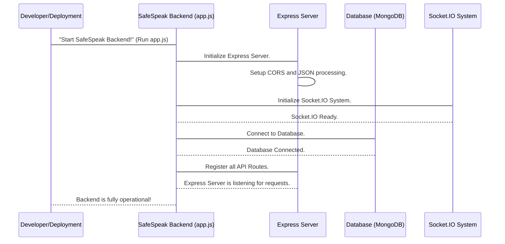

# Chapter 6: Server & API Foundation

In [Chapter 5: Content Safety (Toxicity & Reports)](05_content_safety__toxicity___reports__.md), we explored how SafeSpeak acts as a "content monitor" and "feedback box" to keep conversations safe and respectful. But how do all these different systems – like user authentication, emergency alerts, content safety, and sending emails – actually connect and work together? How does your SafeSpeak app on your phone even "talk" to the SafeSpeak brain running on a server far away?

Imagine SafeSpeak is a large, advanced building. We've talked about the security desk (User & Auth), the mailroom (External Communication), the emergency call center (Emergency Services), and the content moderation office (Content Safety). But for all these parts to function, the building itself needs a strong foundation, an electrical system, plumbing, and a central control room that directs all traffic.

This is exactly what the **Server & API Foundation** does for SafeSpeak. It's the core "engine" and "central hub" that brings everything together. It's responsible for starting up the entire SafeSpeak backend, connecting to the database, setting up rules for how incoming requests are handled, and getting everything ready to respond to your app.

## What Problem Does This System Solve?

Think about how your SafeSpeak app works. When you tap a button, like "Log In" or "Send SOS," your phone sends a request over the internet. This request needs to go to a specific "address," be understood, processed by the right system (e.g., the User & Authentication system for login), and then a response needs to be sent back.

This "Server & API Foundation" solves the crucial problem of:

- **Being the Main Receptionist:** It's the first point of contact for all requests from your phone app or other services.
- **Directing Traffic:** It ensures each request goes to the correct internal "department" (like the `authController` for login or the `sosController` for SOS).
- **Setting Up Essential Services:** It starts the database connection, enables real-time communication, and implements security rules.
- **Keeping the Lights On:** It ensures the entire SafeSpeak backend is running smoothly and is always ready to serve your needs.

Let's focus on the very first step: **How the SafeSpeak backend server starts up and gets ready to serve your app.**

## Key Concepts of the Foundation

This foundational part of SafeSpeak is made up of several critical components working together:

### 1. The Main Engine: Express.js Server

- **What it is:** `Express.js` is like the core "engine" that powers our backend application. It's a popular tool in the world of Node.js (the technology SafeSpeak's backend is built on) for building web applications and APIs.
- **What it does:** It creates a web server that listens for incoming requests from your SafeSpeak app. When your app sends a request, Express is the first to receive it.

### 2. The Navigation System: API Routes

- **What they are:** API (Application Programming Interface) routes are like specific "addresses" or "pathways" that your SafeSpeak app can send requests to. For example, `/api/auth/login` is the pathway for logging in, and `/api/sos/send-sos` is the pathway for sending an SOS.
- **What they do:** Each route is a defined "road" that leads to a specific "controller" (a function that handles the request, like `authController` or `sosController`). This ensures that login requests go to the login handler, SOS requests go to the SOS handler, and so on.

### 3. The Security Checkpoint: CORS & Middleware

- **CORS (Cross-Origin Resource Sharing):** Imagine your SafeSpeak app is from one "country" (a specific web address) and our backend server is in another "country." CORS is like a visa system that allows these two "countries" to communicate securely. Without it, web browsers might block your app from talking to the server because they come from different origins, which is a security feature.
- **Middleware:** These are like "security guards" or "pre-processing steps" that requests go through _before_ they reach their final destination (the controller). For example, our `authMiddleware` (from [Chapter 2: User & Authentication System](02_user___authentication_system_.md)) is a middleware that checks if you have a valid digital token (your ID badge) before letting you access protected features.

### 4. The Memory Connection: Database Foundation

- **What it is:** This is the part that establishes the connection between our SafeSpeak backend and our database (MongoDB, managed with Mongoose).
- **What it does:** It's like plugging in the main power cable to our building's "memory bank." Without this connection, SafeSpeak can't save new users, retrieve emergency contacts, or store messages.

### 5. The Instant Update System: Socket.IO Foundation

- **What it is:** `Socket.IO` is a library that allows for "real-time," two-way communication between your app and the server. Think of it like a dedicated phone line that stays open for instant messages, rather than having to make a new call for every little piece of information.
- **What it does:** It's initialized here, creating the infrastructure for features like live chat or instant SOS alerts. We'll dive much deeper into this in the next chapter.

## How SafeSpeak Starts Up

Let's trace what happens when you start the SafeSpeak backend application, making it ready to serve millions of users!

When the SafeSpeak backend program is launched, it runs the `app.js` file. This file is the central "startup script" for the entire application.

**Simplified Code (from `safespeak-Backend/app.js`):**

```javascript
// safespeak-Backend/app.js
const express = require("express");
const mongoose = require("mongoose");
const cors = require("cors");
const http = require("http");
const { Server } = require("socket.io"); // For real-time communication

// Load environment variables (like database connection string)
require("dotenv").config();

// Create the main Express app and an HTTP server
const app = express();
const server = http.createServer(app);

// Setup Socket.IO to work with our server
const io = new Server(server, { cors: { origin: "*" } });

// Essential setup: enable CORS and allow processing JSON requests
app.use(cors({ origin: "*" })); // Allow communication from any app origin
app.use(express.json()); // Allow the server to understand JSON data

// Database connection details
const MONGO_URI = process.env.MONGO_URI;

// Function to start everything
async function main() {
  try {
    await mongoose.connect(MONGO_URI); // Connect to the database
    console.log("✅ MongoDB Connected");

    // Connect our API pathways to their handlers
    app.use("/api/auth", require("./routes/authRoutes")(io));
    app.use("/api/users", require("./routes/userRoutes"));
    app.use("/api/sos", require("./routes/sosRoutes"));
    app.use("/api/report", require("./routes/reportRoutes"));
    app.use("/api/toxicity", require("./routes/toxicityRoutes"));

    const PORT = process.env.PORT || 5000;
    server.listen(PORT, () =>
      console.log(`🚀 Server running at http://:${PORT}`)
    );
  } catch (err) {
    console.error("❌ Failed to connect MongoDB:", err.message);
    process.exit(1); // Exit if database connection fails
  }
}

main(); // Run the startup function!
```

**Explanation:**

This `app.js` file is where everything begins:

1.  **Imports:** It first brings in all the necessary tools like `express`, `mongoose`, `cors`, `http`, and `socket.io`.
2.  **Configuration:** It loads important settings (like the database address) from a secret `.env` file.
3.  **Server Creation:** It creates the main web server (`app` using `express` and `server` using `http`).
4.  **Socket.IO Setup:** It sets up the `socket.io` system for real-time communication.
5.  **Middleware Setup:**
    - `cors()`: This is like setting up a friendly welcome sign that tells other apps it's okay to talk to this server, even if they are hosted on different addresses (e.g., your phone app vs. the backend server).
    - `express.json()`: This tells the server to automatically understand information sent in JSON format (which is how most apps send data over the internet).
6.  **Database Connection:** The `mongoose.connect()` line attempts to connect to our database. If this fails, the server stops, because SafeSpeak can't work without its memory bank!
7.  **Route Registration:** It then tells the `express` server about all the different API "pathways" (like `/api/auth` or `/api/sos`) and which file (`authRoutes.js`, `sosRoutes.js`, etc.) is responsible for handling requests to those pathways.
8.  **Server Listening:** Finally, `server.listen()` makes the server "turn on" and start listening for incoming requests on a specific "port" (like a phone number for the server).

**Example Output (What you see when the server starts):**

```
✅ MongoDB Connected
🚀 Server running at http://:5000
```

**Explanation:** When you run the SafeSpeak backend, you'll see these messages in your console, indicating that the database connection was successful and the web server is now running and ready to receive requests from your SafeSpeak app.

## What Happens Under the Hood?

Let's visualize the sequence of events when the SafeSpeak backend starts up:



**Non-code Walkthrough:**

1.  **Start Command:** You (or a deployment system) gives the command to start the SafeSpeak backend application. This launches the `app.js` file.
2.  **Express Initialization:** The `app.js` file first sets up the `Express` server, which is like opening the "reception desk" for all incoming internet requests. It also configures it to handle `CORS` (allowing communication from different app locations) and `JSON` data (the common language for web data).
3.  **Socket.IO Initialization:** Next, `app.js` prepares the `Socket.IO` system, which is like installing a special "instant message hotline" so your app can receive live updates.
4.  **Database Connection:** Then, `app.js` attempts to connect to the `Database`. This is a critical step; if it fails, the application can't function.
5.  **Route Registration:** Once the database is connected, `app.js` tells the `Express Server` about all the specific "API routes" (like `/api/auth/login`, `/api/sos/send-sos`). It registers which part of the code (`authRoutes`, `sosRoutes`, etc.) should handle requests arriving at each specific address.
6.  **Server Listening:** Finally, the `Express Server` starts "listening" on a specific network port. This means it's now officially "open for business" and ready to receive and process any requests from your SafeSpeak app!

### Deeper Dive into Code Files

Let's look at the specific files that form this foundation:

- **`safespeak-Backend/app.js`**: This is the central file we've been discussing, the starting point for everything.

  ```javascript
  // safespeak-Backend/app.js (simplified)
  const express = require("express");
  const mongoose = require("mongoose");
  const cors = require("cors");
  const http = require("http");
  const { Server } = require("socket.io");
  require("dotenv").config(); // Load environment variables

  const app = express();
  const server = http.createServer(app);

  // Setup CORS for the web server
  app.use(cors({ origin: "*" }));
  app.use(express.json()); // Enable JSON body parsing

  // Setup Socket.IO for real-time
  const io = new Server(server, { cors: { origin: "*" } });
  io.on("connection", (socket) => {
    console.log("🔌 New client connected:", socket.id);
    // ... more Socket.IO event handlers here ...
  });

  // Connect to MongoDB database
  async function main() {
    try {
      await mongoose.connect(process.env.MONGO_URI);
      console.log("✅ MongoDB Connected");

      // Register API routes
      app.use("/api/auth", require("./routes/authRoutes")(io)); // auth routes use io
      app.use("/api/users", require("./routes/userRoutes"));
      app.use("/api/sos", require("./routes/sosRoutes"));
      app.use("/api/report", require("./routes/reportRoutes"));
      app.use("/api/toxicity", require("./routes/toxicityRoutes"));

      const PORT = process.env.PORT || 5000;
      server.listen(PORT, () =>
        console.log(`🚀 Server running at http://:${PORT}`)
      );
    } catch (err) {
      console.error("❌ Failed to connect MongoDB:", err.message);
      process.exit(1);
    }
  }
  main();
  ```

  **Explanation:** This code snippet shows how `app.js` orchestrates the startup process: initializing `Express`, setting up `CORS` and `JSON` parsing, connecting to `MongoDB` (using `mongoose`), setting up `Socket.IO`, and registering all the application's `API routes` so requests can be directed properly.

- **`safespeak-Backend/middlewares/authMiddleware.js`**: This is an example of a "middleware" that our foundation uses.

  ```javascript
  // safespeak-Backend/middlewares/authMiddleware.js (simplified)
  const jwt = require("jsonwebtoken");

  module.exports = (req, res, next) => {
    const authHeader = req.headers.authorization;
    if (!authHeader || !authHeader.startsWith("Bearer ")) {
      return res.status(401).json({ error: "Unauthorized: No token provided" });
    }
    const token = authHeader.split(" ")[1];
    try {
      const decoded = jwt.verify(token, process.env.JWT_SECRET);
      req.user = decoded; // Attach user info to the request
      next(); // Allow the request to proceed
    } catch (err) {
      return res.status(403).json({ error: "Forbidden: Invalid token" });
    }
  };
  ```

  **Explanation:** This `authMiddleware` acts as a "security guard" that sits between an incoming request and its final destination. When a request comes in for a protected route (like adding an emergency contact or sending an SOS), this middleware checks the user's digital token (ID badge). If the token is valid, `next()` allows the request to continue. If not, it sends an error, preventing unauthorized access.

- **`safespeak-Backend/routes/*.js` (e.g., `routes/authRoutes.js`):** These files define our API "pathways."

  ```javascript
  // safespeak-Backend/routes/authRoutes.js (simplified)
  const express = require("express");

  module.exports = (io) => {
    // This function receives the 'io' object
    const router = express.Router();
    // Import the controller that handles auth logic, passing 'io'
    const authController = require("../controllers/authController")(io);

    router.post("/firebaseAuth", authController.firebaseAuth);
    router.post("/login", authController.logIn);
    router.post("/register", authController.registerController);

    return router;
  };
  ```

  ```javascript
  // safespeak-Backend/routes/sosRoutes.js (simplified)
  const express = require("express");
  const router = express.Router();
  const authMiddleware = require("../middlewares/authMiddleware"); // Our security guard
  const { sendSOS } = require("../controllers/sosController");

  router.post("/send-sos", authMiddleware, sendSOS); // This route uses the authMiddleware

  module.exports = router;
  ```

  **Explanation:** These route files set up specific `router` objects using `express.Router()`. Each `router.post()` or `router.get()` defines a specific URL path (like `/login` or `/send-sos`) and tells Express which "controller" function should handle requests to that path. Notice how `authRoutes` can receive the `io` object (for real-time features), and how `sosRoutes` uses `authMiddleware` to protect the `/send-sos` route, ensuring only authenticated users can send an SOS.

## Conclusion

You've now uncovered the very heart of SafeSpeak: the **Server & API Foundation**. This crucial system, powered by `Express.js`, `CORS`, `Mongoose`, and `Socket.IO`, acts as the main engine and navigation system for the entire application. It ensures that the backend is always ready to receive requests, direct them to the right place, maintain security, connect to the database, and even prepare for instant real-time communication. All the features we've discussed in previous chapters rely on this robust foundation to function.

Now that we understand how the server starts and manages general communication, let's dive deeper into one of its most exciting capabilities: the instant updates and live interactions made possible by `Socket.IO`. In the next chapter, we'll explore [Real-time Interactions (Socket.IO)](07_real_time_interactions__socket_io__.md).

---
