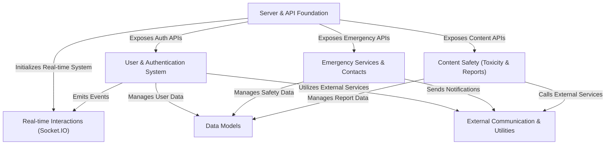

# Tutorial: SafeSpeak

SafeSpeak is a **personal safety application** designed to provide immediate help in _emergency situations_ and ensure a _safe communication environment_. It allows users to send **SOS alerts** to their trusted contacts with their location, features _real-time content monitoring_ for harmful language, and enables users to report concerns. The app securely manages user accounts and facilitates _instant updates_ and interactions.

## Visual Overview

## Chapters

1. [Data Models
   ](01_data_models_.md)
2. [User & Authentication System
   ](02_user___authentication_system_.md)
3. [External Communication & Utilities
   ](03_external_communication___utilities_.md)
4. [Emergency Services & Contacts
   ](04_emergency_services___contacts_.md)
5. [Content Safety (Toxicity & Reports)
   ](05_content_safety__toxicity___reports__.md)
6. [Server & API Foundation
   ](06_server___api_foundation_.md)
7. [Real-time Interactions (Socket.IO)
   ](07_real_time_interactions__socket_io__.md)

---
